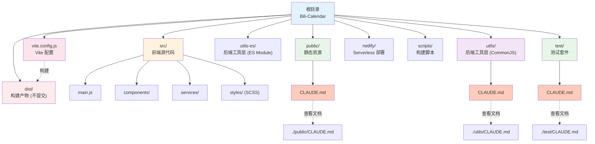

# Bili-Calendar 项目指导文件

> **最后更新**: 2025-12-01
> **版本**: v1.2.0
> **项目类型**: Node.js Web 应用 (Express + Vite + Vanilla JS)

---

## 变更记录 (Changelog)

### 2025-12-01
- **[架构重构]** 从传统静态文件迁移到 Vite 构建系统
- **[前端工程化]** 引入 ES Module、SCSS、组件化开发
- **[构建优化]** 添加 Vite 7.x 构建工具，支持热重载和代码分割
- **[部署修复]** 更新 Dockerfile 和 netlify.toml 配置
- **[文档更新]** 同步更新项目架构文档，反映新的目录结构

### 2025-11-30
- **[架构师初始化]** 自动生成项目索引与模块结构图
- **[文档增强]** 添加 Mermaid 模块可视化图表
- **[元数据]** 生成 `.claude/index.json` 项目索引文件
- **[导航优化]** 为各模块文档添加面包屑导航

### 2025-11-23
- 重构项目文档结构，统一命名规范
- 移除 Mermaid 图表和 emoji 装饰
- 更新代码规范、日志规范、异常处理指南

---

## 项目概览

**Bili-Calendar** 是一个将 B站追番列表转换为日历订阅的 Web 服务，支持 iCal/ICS 格式，兼容 Apple/Google/Outlook 等主流日历应用。

### 核心功能

- 自动同步 B站追番列表到日历应用
- 精确解析番剧更新时间，支持时区转换
- 智能处理连载/完结番剧的重复规则
- 隐私保护：服务端不存储用户数据

---

## 项目架构

```
┌─────────────────────────────────────────────────────────────────┐
│                    客户端 (Vite 开发/构建)                        │
│  ┌──────────┐  ┌──────────┐  ┌──────────┐  ┌──────────┐        │
│  │ main.js  │  │ i18n.js  │  │ cache    │  │ error    │        │
│  │ (入口)    │  │ (多语言) │  │ Manager  │  │ Handler  │        │
│  └────┬─────┘  └──────────┘  └──────────┘  └──────────┘        │
│       │ Vite Build → dist/                                      │
└───────┼─────────────────────────────────────────────────────────┘
        │ HTTP Request
        ▼
┌─────────────────────────────────────────────────────────────────┐
│                      服务器 (server.js)                          │
│  ┌──────────────────────────────────────────────────────┐      │
│  │ Express 中间件: compression → security → rate-limit  │      │
│  └──────────────────────────────────────────────────────┘      │
│          │                                                      │
│          ▼                                                      │
│  ┌──────────────┐    ┌──────────────┐    ┌──────────────┐      │
│  │ /api/:uid    │    │ /preview/:uid│    │ 静态文件服务  │      │
│  │ (ICS生成)    │    │ (番剧预览)   │    │ (dist/)      │      │
│  └──────┬───────┘    └──────────────┘    └──────────────┘      │
└─────────┼───────────────────────────────────────────────────────┘
          │
          ▼
┌─────────────────────────────────────────────────────────────────┐
│                       工具层 (utils/)                            │
│  ┌────────────┐  ┌─────────┐  ┌─────────────┐  ┌────────────┐  │
│  │ bangumi.cjs│  │ ics.cjs │  │rate-limiter │  │request-dedup│  │
│  │ (B站API)   │  │(ICS生成)│  │  (限流)      │  │  (去重)     │  │
│  └────────────┘  └─────────┘  └─────────────┘  └────────────┘  │
└─────────────────────────────────────────────────────────────────┘
```

---

## 项目技术栈

| 层级 | 技术 | 版本要求 |
|------|------|----------|
| **运行时** | Node.js | >= 18.0.0 |
| **后端框架** | Express.js | ^4.18.2 |
| **HTTP 客户端** | Axios | ^1.12.0 |
| **前端框架** | Vanilla JavaScript | ES2022+ |
| **构建工具** | Vite | ^7.2.4 |
| **样式预处理** | SCSS/Sass | ^1.94.2 |
| **部署** | Docker / Netlify Functions | - |
| **测试** | Node.js 内置测试框架 | - |
| **代码检查** | ESLint + Prettier | ESLint 9.x |

---

## 项目模块划分

### 文件与文件夹布局

```
Bili-Calendar/
├── server.js                    # [入口] Express 主服务器
├── package.json                 # 项目配置与依赖
├── vite.config.js               # Vite 构建配置
├── index.html                   # 前端入口 HTML
│
├── src/                         # [前端] 源代码目录
│   ├── main.js                  # 前端入口文件
│   ├── components/              # 组件目录
│   │   └── AnimePreview.js      # 番剧预览组件
│   ├── services/                # 服务模块
│   │   ├── i18n.js              # 国际化支持
│   │   ├── cacheManager.js      # 缓存管理
│   │   ├── errorHandler.js      # 错误处理
│   │   └── pwa.js               # PWA 初始化
│   ├── styles/                  # 样式目录 (SCSS)
│   │   ├── app.scss             # 主样式入口
│   │   ├── _modules.scss        # 模块化样式
│   │   ├── _preview.scss        # 预览样式
│   │   ├── _loading.scss        # 加载动画
│   │   ├── _error.scss          # 错误样式
│   │   ├── _dark.scss           # 暗黑模式
│   │   └── _history.scss        # 历史记录样式
│   └── utils/                   # 前端工具函数
│
├── dist/                        # [构建产物] Vite 打包输出 (不提交到 Git)
│   ├── index.html               # 处理后的 HTML
│   ├── assets/                  # 打包后的 JS/CSS
│   └── ...                      # 其他静态资源
│
├── public/                      # [静态资源] 直接复制到 dist/
│   ├── favicon.ico              # 网站图标
│   ├── manifest.webmanifest     # PWA 清单
│   ├── sw.js                    # Service Worker
│   ├── icons/                   # 应用图标
│   └── CLAUDE.md                # 前端模块文档
│
├── utils/                       # [后端] 工具模块 (CommonJS)
│   ├── bangumi.cjs              # B站番剧数据获取
│   ├── ics.cjs                  # ICS 日历文件生成
│   ├── rate-limiter.cjs         # 请求速率限制
│   ├── request-dedup.cjs        # 请求去重
│   ├── time.cjs                 # 时间处理工具
│   ├── http.cjs                 # HTTP 请求工具
│   ├── constants.cjs            # 常量定义
│   └── ip.cjs                   # IP 提取工具
│
├── utils-es/                    # [后端] ES Module 版本 (Netlify)
│   └── ...                      # 与 utils/ 同构
│
├── netlify/                     # [部署] Netlify Functions
│   ├── functions/               # Serverless 函数源码
│   │   └── server.js            # API 函数入口
│   └── functions-build/         # 构建产物
│
├── test/                        # [测试] 单元测试
│   ├── utils.ics.test.js
│   ├── utils.time.test.js
│   ├── utils.rate-limiter.test.js
│   └── utils.request-dedup.test.js
│
├── scripts/                     # [构建] 构建脚本
│   ├── build-netlify.mjs
│   └── update-readme-year.js
│
└── assets/                      # [文档] 文档资源
```

---

## 模块结构可视化



---

## 模块索引

| 模块名称 | 路径 | 职责描述 | 文档链接 |
|---------|------|---------|---------|
| **前端源代码** | `src/` | 用户界面、交互逻辑、组件、样式（Vite 构建） | - |
| **静态资源** | `public/` | 直接复制到构建产物的资源（图标、PWA） | [查看文档](./public/CLAUDE.md) |
| **构建产物** | `dist/` | Vite 打包输出（不提交到 Git） | - |
| **后端工具层 (CommonJS)** | `utils/` | B站API、ICS生成、限流、去重、时间处理 | [查看文档](./utils/CLAUDE.md) |
| **后端工具层 (ES Module)** | `utils-es/` | Netlify Serverless 环境专用 | - |
| **测试套件** | `test/` | 单元测试、集成测试 | [查看文档](./test/CLAUDE.md) |
| **Serverless 部署** | `netlify/` | Netlify Functions 配置与构建产物 | - |
| **构建脚本** | `scripts/` | Netlify 构建、README 更新脚本 | - |
| **Vite 配置** | `vite.config.js` | 前端构建与开发服务器配置 | - |

---

## 项目业务模块

### 核心业务流程

1. **订阅生成流程**
   - 用户输入 B站 UID
   - 调用 `/api/:uid` 接口
   - 后端从 B站 API 获取追番数据
   - 过滤正在播出的番剧
   - 生成 ICS 日历文件
   - 返回日历文件或订阅链接

2. **番剧预览流程**
   - 用户点击预览按钮
   - 调用 `/preview/:uid` 接口
   - 返回番剧列表 JSON
   - 前端渲染预览卡片

### 关键模块职责

| 模块 | 文件 | 职责 |
|------|------|------|
| **B站 API** | `utils/bangumi.cjs` | 获取用户追番列表，过滤连载番剧 |
| **ICS 生成** | `utils/ics.cjs` | 将番剧数据转换为 ICS 格式 |
| **限流器** | `utils/rate-limiter.cjs` | 基于 IP 的请求速率限制 |
| **去重器** | `utils/request-dedup.cjs` | 防止相同请求并发执行 |
| **时间处理** | `utils/time.cjs` | 解析播出时间，计算下次更新 |

---

## 项目代码风格与规范

### 命名约定

| 类型 | 约定 | 示例 |
|------|------|------|
| **变量** | camelCase | `rateLimiter`, `bangumiData` |
| **函数** | camelCase | `getBangumiData()`, `generateICS()` |
| **常量** | SCREAMING_SNAKE_CASE | `BILIBILI_API_BASE_URL`, `CACHE_TTL` |
| **类** | PascalCase | `RateLimiter`, `CacheManager` |
| **文件 (后端)** | kebab-case + .cjs | `rate-limiter.cjs`, `request-dedup.cjs` |
| **文件 (前端)** | kebab-case + .js | `cache-manager.js`, `error-handler.js` |
| **CSS 类** | kebab-case | `.error-container`, `.anime-card` |
| **HTML ID** | kebab-case | `uid-input`, `generate-btn` |

### 代码风格

项目使用 **ESLint + Prettier** 进行代码规范检查：

```json
// .prettierrc.json
{
  "printWidth": 100,
  "singleQuote": true,
  "semi": true,
  "trailingComma": "es5"
}
```

```javascript
// eslint.config.js 核心规则
{
  'no-var': 'warn',
  'prefer-const': 'warn',
  'no-unused-vars': ['warn', { argsIgnorePattern: '^_' }],
  'no-console': 'off'  // 允许 console（用于日志）
}
```

#### Import 规则

**后端 (utils/*.cjs) - CommonJS**:
```javascript
// 1. Node.js 内置模块
const { createRequire } = require('module');
const path = require('path');

// 2. 第三方依赖
const axios = require('axios');

// 3. 本地模块
const { httpClient } = require('./http.cjs');
const { parseBroadcastTime } = require('./time.cjs');
```

**前端 (public/*.js) - ES Module**:
```javascript
// 前端使用浏览器原生模块系统，无需 import 语句
// 所有脚本通过 <script> 标签加载，共享全局作用域
```

**服务器入口 (server.js) - ES Module + CommonJS 混合**:
```javascript
// ES Module 导入
import express from 'express';
import compression from 'compression';

// CommonJS 桥接（用于 .cjs 模块）
import { createRequire } from 'module';
const require = createRequire(import.meta.url);
const { getBangumiData } = require('./utils/bangumi.cjs');
```

#### 依赖注入

本项目采用**工厂函数模式**进行依赖注入：

```javascript
// 创建实例的工厂函数
function createRateLimiter(options = {}) {
  const config = {
    windowMs: options.windowMs || 15 * 60 * 1000,
    maxRequests: options.maxRequests || 100,
    ...options
  };

  return new RateLimiter(config);
}

// 使用
const rateLimiter = createRateLimiter({ maxRequests: 50 });
```

#### 日志规范

项目使用 **console + emoji** 进行日志记录：

```javascript
// 信息日志
console.log(`📥 ${req.method} ${req.originalUrl} - IP: ${ip}`);

// 成功日志
console.log(`✅ ${req.method} ${req.originalUrl} - ${statusCode} - ${duration}ms`);

// 警告日志
console.warn(`⚠️ B站API返回业务错误: code=${code}, message=${message}`);

// 错误日志
console.error(`❌ 请求失败: ${error.message}`);

// 统计日志
console.log(`📊 [UID:${uid}] 总共 ${total} 部番剧，过滤后 ${filtered} 部`);
```

**日志级别规范**:
| 级别 | 方法 | 用途 | Emoji |
|------|------|------|-------|
| INFO | `console.log` | 正常流程、统计信息 | 📥 ✅ 📊 🔍 |
| WARN | `console.warn` | 业务警告、非致命错误 | ⚠️ |
| ERROR | `console.error` | 系统错误、异常 | ❌ |

#### 异常处理

**后端异常处理模式**:
```javascript
async function getBangumiData(uid) {
  try {
    const response = await httpClient.get(url);

    // 业务错误处理
    if (response.data.code !== 0) {
      return {
        error: 'API Error',
        message: response.data.message,
        code: response.data.code
      };
    }

    return response.data;
  } catch (error) {
    // 网络/系统错误
    console.error(`❌ 获取番剧数据失败: ${error.message}`);
    return null;
  }
}
```

**前端异常处理模式**:
```javascript
async function generateSubscription(uid) {
  try {
    const response = await fetch(`/api/${uid}`);

    if (!response.ok) {
      throw new Error(`HTTP ${response.status}`);
    }

    return await response.text();
  } catch (error) {
    showError(identifyError(error));
    return null;
  }
}
```

#### 参数校验

**UID 校验**:
```javascript
// 纯数字，长度 1-20
function validateUID(uid) {
  return /^\d{1,20}$/.test(uid);
}
```

**服务端校验**:
```javascript
app.get('/api/:uid', (req, res) => {
  const uid = req.params.uid;

  if (!validateUID(uid)) {
    return res.status(400).json({
      error: 'Invalid UID',
      message: 'UID 必须是纯数字'
    });
  }

  // ...
});
```

#### 其他规范

1. **注释语言**: 中文注释（与代码库保持一致）
2. **注释风格**: JSDoc 风格
3. **缩进**: 2 空格
4. **行尾**: LF (Unix)
5. **文件编码**: UTF-8

```javascript
/**
 * 获取B站用户追番数据并过滤正在播出的番剧
 *
 * @param {string|number} uid - B站用户UID，必须是纯数字
 * @returns {Promise<Object|null>} 返回值说明：
 *   - 成功: { code: 0, data: { list: Array }, filtered_count: number }
 *   - 业务错误: { code: number, message: string, error: string }
 *   - 网络错误: null
 */
async function getBangumiData(uid) {
  // ...
}
```

---

## 测试与质量

### 单元测试

**测试框架**: Node.js 内置测试框架 (`node:test`)

**测试文件命名**: `{模块名}.test.js`

**测试示例**:
```javascript
import assert from 'node:assert/strict';
import { describe, it } from 'node:test';

describe('utils/ics.cjs', () => {
  it('generateICS: basic calendar structure', () => {
    const sample = [{ title: '测试番', season_id: 123 }];
    const ics = generateICS(sample, '614500');

    assert.match(ics, /BEGIN:VCALENDAR/);
    assert.match(ics, /END:VCALENDAR/);
  });
});
```

**测试覆盖范围**:
| 模块 | 覆盖率 | 文件 |
|------|--------|------|
| `ics.cjs` | ~85% | `utils.ics.test.js` |
| `time.cjs` | ~90% | `utils.time.test.js` |
| `rate-limiter.cjs` | ~95% | `utils.rate-limiter.test.js` |
| `request-dedup.cjs` | ~95% | `utils.request-dedup.test.js` |

### 集成测试

当前项目暂无集成测试，计划覆盖：
- [ ] API 端点测试 (`/api/:uid`)
- [ ] 错误场景测试 (隐私设置、无效 UID)
- [ ] B站 API Mock 测试

---

## 项目构建、测试与运行

### 环境与配置

| 环境变量 | 说明 | 默认值 |
|----------|------|--------|
| `PORT` | 服务器端口 | `3000` |
| `NODE_ENV` | 运行环境 (`development` / `production`) | `development` |

### 常用命令

```bash
# 安装依赖
npm install

# 开发模式 (热重载)
npm run dev

# 生产模式
npm start

# 运行测试
npm test

# 代码检查
npm run lint

# 代码格式化
npm run format:write

# 构建 Netlify Functions
npm run build
```

### Docker 部署

```bash
# 构建镜像
docker build -t bili-calendar .

# 运行容器
docker run -p 3000:3000 bili-calendar

# Docker Compose
docker-compose up -d
```

---

## Git 工作流程

### 分支策略

| 分支 | 用途 |
|------|------|
| `main` | 主分支，稳定版本 |
| `feature/*` | 功能开发分支 |
| `fix/*` | Bug 修复分支 |
| `docs/*` | 文档更新分支 |

### 提交规范

遵循 **Conventional Commits** 规范：

```
<type>(<scope>): <description>

[optional body]

[optional footer]
```

**类型 (type)**:
| 类型 | 说明 |
|------|------|
| `feat` | 新功能 |
| `fix` | Bug 修复 |
| `docs` | 文档更新 |
| `style` | 代码格式 (不影响逻辑) |
| `refactor` | 重构 |
| `test` | 测试相关 |
| `chore` | 构建/工具链 |

**示例**:
```
feat(ics): 添加时区自动检测功能

- 支持根据番剧播出地区自动设置时区
- 默认使用 Asia/Shanghai

Closes #123
```

### 版本管理

遵循 **Semantic Versioning** (SemVer)：
- **MAJOR**: 不兼容的 API 变更
- **MINOR**: 向后兼容的功能新增
- **PATCH**: 向后兼容的 Bug 修复

---

## 文档目录

### 文档存储规范

```
项目根目录/
├── CLAUDE.md                    # [根] 项目指导文件（本文件）
├── README.md                    # 中文用户文档
├── README.en.md                 # 英文用户文档
│
├── public/
│   └── CLAUDE.md                # 前端模块文档
│
├── utils/
│   └── CLAUDE.md                # 工具模块文档
│
└── test/
    └── CLAUDE.md                # 测试模块文档
```

### 文档索引

| 文档 | 路径 | 说明 |
|------|------|------|
| **项目指导** | `/CLAUDE.md` | 项目整体架构与规范（本文件） |
| **前端模块** | `/public/CLAUDE.md` | 前端应用层详细文档 |
| **工具模块** | `/utils/CLAUDE.md` | 后端工具层详细文档 |
| **测试模块** | `/test/CLAUDE.md` | 测试套件详细文档 |
| **用户文档** | `/README.md` | 面向用户的使用说明 |

### 文档维护规则

1. **同步更新**: 代码变更时同步更新相关文档
2. **版本标记**: 文档顶部标注最后更新时间
3. **模块隔离**: 每个主要模块维护独立的 `CLAUDE.md`
4. **链接有效**: 确保文档间的相互引用链接有效

---

## 相关链接

- **在线服务**: https://calendar.cosr.eu.org
- **GitHub 仓库**: https://github.com/Silentely/Bili-Calendar
- **Docker 镜像**: ghcr.io/silentely/bili-calendar
- **问题反馈**: https://github.com/Silentely/Bili-Calendar/issues

---

## 许可证

MIT License - 详见 [LICENSE](./LICENSE)
