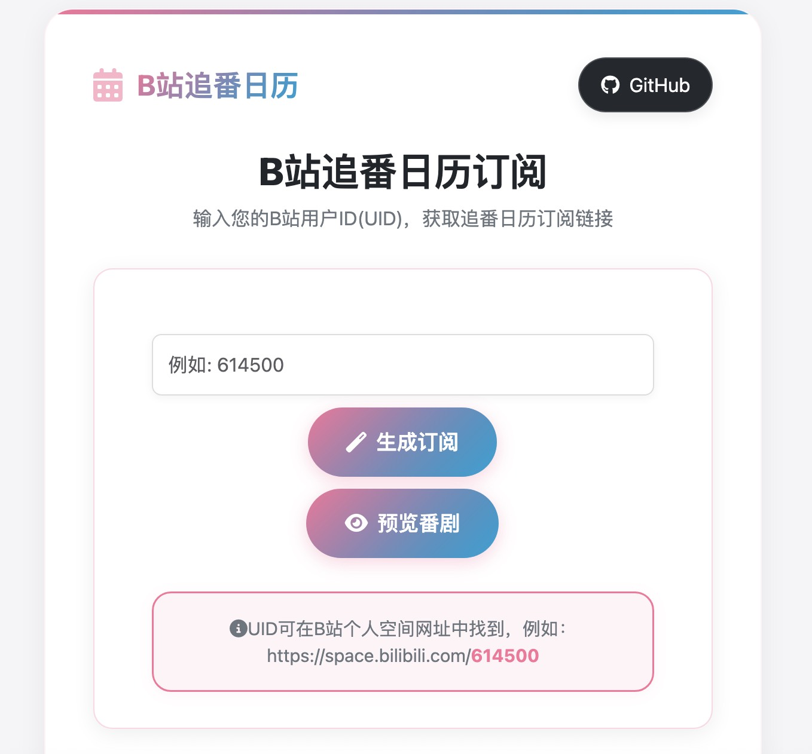
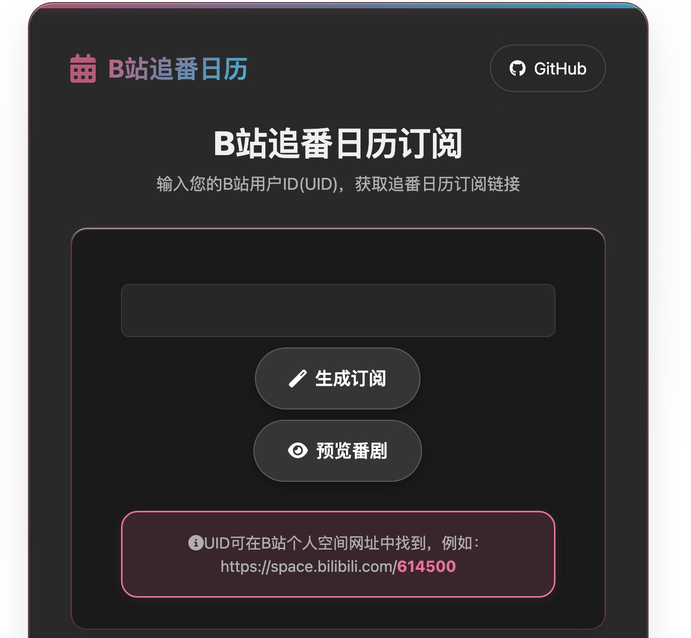
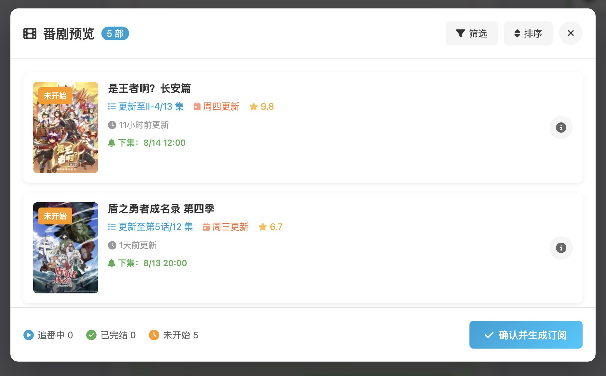
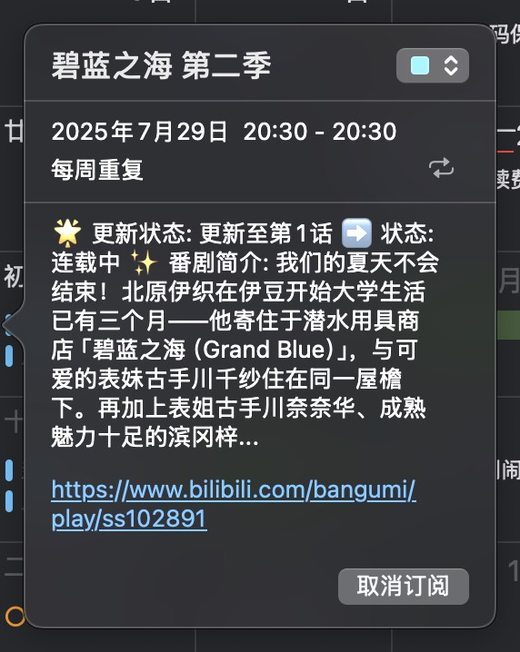

<div align="center">
<h1 align="center">Bili-Calendar (Bilibili Anime Calendar)<br></img></h1>
</img>
<br>


<br>


<br>
  <a href="https://github.com/Silentely/Bili-Calendar/pkgs/container/bili-calendar">
    
  </a>
</div>

---

[中文](./README.md) | **English**

---

> 🎉 **Convert your Bilibili anime list to calendar subscriptions, compatible with Apple Calendar, Google Calendar, Outlook and more!**

---

## ✨ Features

### Core Features

- 📅 **Auto Sync**: Generate calendar subscription from Bilibili anime list with one click
- 🕒 **Accurate Time**: Precisely parse anime update time with automatic timezone conversion
- 🔁 **Smart Repeat**: Airing shows automatically repeat weekly, finished shows show premiere time only
- 📱 **Multi-Platform**: Compatible with Apple Calendar, Google Calendar, Outlook and all ICS-supported calendar apps
- 🚀 **Easy to Use**: Simply provide your Bilibili UID to generate subscription link
- 🔒 **Privacy Protection**: No user data stored on server, supports self-hosting

### 🆕 New Features

- 🌙 **Dark Mode**: Auto follows system theme, supports manual toggle to protect eyes
- 👁️ **Anime Preview**: Preview all anime content before subscribing, see update time and status
- 💾 **Local Cache**: Smart caching to reduce API calls and improve response speed
- 📝 **History**: Auto saves last 10 UIDs used, quick account switching
- 📱 **PWA Support**: Installable as standalone app, supports offline access
- 🎨 **Enhanced UI/UX**: Beautiful animations, loading states, error guidance
- ⌨️ **Keyboard Shortcuts**: Supports shortcuts for improved efficiency
- 📱 **Mobile Optimization**: Perfect mobile device adaptation, touch optimized
- 🔔 **Reminder Upgrade**: Choose 5/10/15 min lead time for browser notifications in preview; optional WebPush (requires VAPID)
- 📊 **Monitoring Metrics**: `/metrics` JSON and `/metrics/prometheus` (Prometheus text) with p95/p99 and per-route stats
- 🌍 **Internationalization**: Supports multiple languages (Chinese, English), easy to switch
- 🔀 **External Calendar Merge**: `/aggregate/:uid.ics?sources=` merges up to 5 external ICS feeds into one subscription

### 🔐 Security & Compliance

- Enabled security response headers (X-Content-Type-Options, Referrer-Policy, X-Frame-Options, HSTS)
- Baseline CSP: Same-origin primary, whitelist necessary CDNs for styles and fonts; inline scripts retained (can gradually migrate to nonce/hash)
- Service Worker only intercepts same-origin requests, avoiding external link prefetch triggering CSP (offline only covers local assets)

---

## 📸 Preview

> Screenshots showing the new frontend interface, dark mode, anime preview and calendar subscription effects:

|          Light Mode          |          Dark Mode          |       Anime Preview       |
| :--------------------------: | :-------------------------: | :-----------------------: |
|  |  |  |

|          Mobile View          |          Calendar View          |          Event Detail          |
| :---------------------------: | :-----------------------------: | :----------------------------: |
|  |  |  |

### Interface Features

- **Responsive Design**: Auto adapts to desktop and mobile devices
- **Smooth Animations**: Elegant transition effects and loading animations
- **Smart Hints**: Detailed error messages and solutions
- **History**: Quick access to recently used accounts

---

## 🚀 Quick Start

### Public Service (Recommended)

1. Visit [https://calendar.cosr.eu.org](https://calendar.cosr.eu.org)
2. Enter your Bilibili UID (found in your Bilibili profile URL, e.g., `614500` from `https://space.bilibili.com/614500`)
3. Click "Generate" button (or press Enter)
4. (Optional) Click "Preview" to view anime list
5. Add the generated subscription link to your calendar app  
   PS: You can also directly copy `https://calendar.cosr.eu.org/uid` format link into your calendar app subscription

### 🌍 Language Switching

The website supports multiple languages:

- **Chinese (中文)**: Default language
- **English**: Full English interface

**How to Switch Language:**

1. Locate the language button in the top-right corner
2. Click it to toggle between English and 中文
3. Page content updates instantly to the selected language

Language preference is automatically saved and restored on next visit.

### 📲 PWA Installation Guide

#### Desktop (Chrome/Edge)

1. Visit the website, an install icon will appear on the right side of address bar
2. Click the install icon and confirm
3. App will run as standalone window

#### Mobile (iOS)

1. Open website in Safari
2. Tap Share button
3. Select "Add to Home Screen"
4. Tap "Add" to confirm

#### Mobile (Android)

1. Open website in Chrome
2. Tap menu in top-right corner
3. Select "Add to Home Screen"
4. Confirm installation

### ⌨️ Keyboard Shortcuts

| Shortcut       | Function                |
| -------------- | ----------------------- |
| `Enter`        | Generate/Execute action |
| `Ctrl/Cmd + K` | Focus search box        |
| `Ctrl/Cmd + P` | Preview anime list      |
| `Ctrl/Cmd + D` | Toggle dark mode        |
| `Ctrl/Cmd + H` | Show/Hide history       |
| `Ctrl/Cmd + C` | Copy subscription link  |
| `Esc`          | Close popup/Clear input |

---

## 🛠️ Self-Hosting

### Using Docker (Recommended)

```bash
# Create docker-compose.yml file
version: '3.8'
services:
  bili-calendar:
    image: ghcr.io/silentely/bili-calendar:latest
    ports:
      - "3000:3000"
    environment:
      - BILIBILI_COOKIE=  # Optional, improves API access success rate
      - NODE_ENV=production
      - TZ=Asia/Shanghai
    restart: unless-stopped
    volumes:
      - ./logs:/app/logs  # Optional, for persistent logs

# Start service
docker-compose up -d
```

### Manual Deployment

```bash
# Clone repository
git clone https://github.com/Silentely/Bili-Calendar.git
cd Bili-Calendar

# Install dependencies
npm install

# Start service
npm start

# Or run in development mode
npm run dev
```

---

## 📡 API Endpoints

### Get User Anime Calendar

```
GET /:uid
```

Parameters:

- `uid`: Bilibili user UID

Returns: ICS format calendar file

### Get User Anime Data (JSON)

```
GET /api/bangumi/:uid
```

Parameters:

- `uid`: Bilibili user UID

Returns: Bilibili anime list JSON data

> **Rate Limit**: To prevent abuse, direct API access is limited to 3 times per IP per hour. Internal project calls are not subject to this limit. API response headers include `X-RateLimit-*` fields to understand current usage.

### Aggregated Subscription (experimental)

```
GET /aggregate/:uid.ics?sources=<url1>,<url2>
```

Parameters:

- `uid`: Bilibili user UID
- `sources`: optional extra ICS links, URL encoded
  - Accepts repeated `sources` params or comma-separated list
  - Only `http://` and `https://` are allowed
  - Links pointing to private/local addresses are rejected automatically to mitigate SSRF
  - Up to 5 external sources, exceeding returns `400`

Returns: ICS that merges Bilibili anime with external calendars. Each imported event contains `X-BC-SOURCE` to indicate origin, making it easy to filter in calendar apps.

Example:

```
curl -G "https://calendar.cosr.eu.org/aggregate/614500.ics" \
  --data-urlencode "sources=https://example.com/work.ics" \
  --data-urlencode "sources=https://example.com/travel.ics"
```

> ⚠️ **Heads-up**: The aggregation endpoint still depends on the Bilibili API. If the upstream is temporarily unavailable it returns 502. Calendar clients usually retry & cache results; when testing in browser simply retry later.

### Frontend Page

```
GET /
```

Returns: Frontend page where users can input Bilibili UID to generate subscription link

### Health Check

```
GET /status
```

Returns: Service status information for health checks

---

## ⚙️ Configuration

### Environment Variables

| Variable                   | Default       | Description                                           |
| -------------------------- | ------------- | ----------------------------------------------------- |
| `PORT`                     | 3000          | Service listening port                                |
| `BILIBILI_COOKIE`          | Empty         | Bilibili Cookie, improves API access success rate     |
| `NODE_ENV`                 | development   | Runtime environment (development/production)          |
| `TZ`                       | Asia/Shanghai | Timezone setting                                      |
| `API_RATE_LIMIT`           | 3             | API call rate limit (times/window)                    |
| `API_RATE_WINDOW`          | 3600000       | Rate limit time window (milliseconds, default 1 hour) |
| `ENABLE_RATE_LIMIT`        | true          | Enable rate limiting (true/false)                     |
| `HTTP_TIMEOUT_MS`          | 10000         | HTTP request timeout (milliseconds)                   |
| `HTTP_RETRY_MAX`           | 2             | HTTP request max retry count                          |
| `HTTP_RETRY_BASE_DELAY_MS` | 300           | HTTP retry base delay (milliseconds)                  |
| `VAPID_PUBLIC_KEY`         | Empty         | Optional, WebPush public key                          |
| `VAPID_PRIVATE_KEY`        | Empty         | Optional, WebPush private key                         |
| `VAPID_SUBJECT`            | mailto:...    | Optional VAPID subject (from generator)               |
| `PUSH_STORE_FILE`          | ./data/push-subscriptions.json | Optional, persistent subscription file (server deployment) |
| `PUSH_ADMIN_TOKEN`         | Empty         | Optional token protecting `/push/test` admin endpoint |
| `TRUST_PROXY`              | disabled      | Optional Express `trust proxy` config (`true`/`false`/hops/IP). Only enable behind trusted proxies |

### Notes

1. **Privacy Settings**: Your Bilibili anime list must be set to public to be accessible
2. **Cookie Settings**: If encountering access frequency limits, set `BILIBILI_COOKIE` environment variable
3. **Timezone Handling**: Service defaults to UTC+8 (Beijing Time), ensure deployment environment timezone is correct
4. **Push Reminder (experimental)**: Run `node scripts/generate-vapid.js` to generate VAPID keys and set env vars, then click “Enable Push” on frontend; without config the button fails gracefully
5. **Push Storage**: By default subscriptions are saved to `./data/push-subscriptions.json` (configurable via `PUSH_STORE_FILE`). Netlify/serverless builds fall back to in-memory storage only
6. **Push Security**: `/push/test` is only registered when `NODE_ENV=development`. For local testing provide `PUSH_ADMIN_TOKEN` and send `Authorization: Bearer <token>` (or `?token=`). Production builds keep it disabled by default
7. **Proxy Trust**: By default Express ignores `X-Forwarded-*`. If you deploy behind a trusted proxy/CDN, set `TRUST_PROXY` (e.g. `true`, `1`, or a subnet) and pair it with proxy-side IP filtering
8. **Prometheus**: Use `/metrics/prometheus` or `/metrics` JSON; per-route stats are in-memory and reset on restart

---

## 💻 Development Guide

### Project Structure

```
Bili-Calendar/
├── server.js              # Main service (container/local)
├── netlify.toml           # Netlify config
├── .github/               # GitHub config directory
│   └── workflows/         # GitHub Actions workflow config
│       └── docker-build.yml # Docker image auto-build config
├── netlify/
│   └── functions/
│       └── server.js      # Netlify Functions entry (CJS)
├── public/                # Static files directory
│   ├── index.html         # Frontend page
│   ├── i18n.js            # Internationalization module
│   ├── styles.css         # Base styles
│   ├── styles-dark.css    # Dark mode styles
│   ├── loading-animations.css # Loading animation styles
│   ├── error-guide.css    # Error guidance styles
│   ├── anime-preview.css  # Anime preview styles
│   ├── cache-history.css  # Cache history styles
│   ├── mobile-enhancements.css # Mobile optimization styles
│   ├── app.js             # Main app logic
│   ├── error-handler.js   # Error handling module
│   ├── anime-preview.js   # Anime preview module
│   ├── cache-manager.js   # Cache management module
│   ├── sw.js              # Service Worker
│   └── manifest.webmanifest # PWA manifest file
├── utils/                 # Utility functions directory
│   ├── time.cjs           # Time handling (backend/functions)
│   ├── ics.cjs            # ICS generation (backend/functions)
│   ├── http.cjs           # HTTP client (backend/functions)
│   ├── bangumi.cjs        # Bilibili data fetching (backend/functions)
│   └── bangumi.js         # Misuse protection
├── assets/                # Asset files directory
│   └── icons/             # PWA icons
├── Dockerfile             # Docker image config
├── docker-compose.yml     # Docker Compose config
├── package.json           # Node.js project config
├── IMPROVEMENTS.md        # Feature improvements doc
├── README.md              # Project documentation (Chinese)
└── README.en.md           # Project documentation (English)
```

### Local Development

```bash
# Install dependencies
npm install

# Start development server (with hot reload)
npm run dev

# Build and start production server
npm run start:prod

# Run tests
npm test

# Code linting and formatting
npm run lint
npm run format
```

### Frontend Modules

| Module        | Functionality              | Files                           |
| ------------- | -------------------------- | ------------------------------- |
| Main App      | Core business logic, theme | `app.js`                        |
| I18n          | Multi-language support     | `i18n.js`                       |
| Error Handler | Smart error hints          | `error-handler.js`              |
| Anime Preview | Anime list display         | `anime-preview.js`              |
| Cache Manager | Data cache and history     | `cache-manager.js`              |
| PWA           | Offline support            | `sw.js`, `manifest.webmanifest` |

---

## 🌍 Internationalization (i18n)

The project now supports multiple languages, making it accessible to users worldwide.

### Supported Languages

- **Chinese (中文)**: Default language
- **English**: Full English interface

### Adding New Languages

To add a new language:

1. Open `/public/i18n.js`
2. Add a new language entry in the `translations` object:

```javascript
'ja-JP': {
  'app.title': 'Bili カレンダー',
  'app.subtitle': 'あなたのBilibili UIDを入力してアニメカレンダーの購読を取得',
  // ... add all translation keys
}
```

3. Update the toggle logic in `/public/app.js` (`cycleLanguage`) and `/public/i18n.js` (`updateLanguageToggleLabel`) so the new language can be reached from the header switcher.

### Translation Keys

All text strings use translation keys following the format `section.key`. For example:

- `app.title`: Application title
- `input.placeholder`: Input field placeholder
- `error.invalidUid.title`: Error title for invalid UID

### Automatic Language Detection

The system automatically:

- Detects browser language on first visit
- Falls back to Chinese if detected language is not supported
- Saves user's language preference to localStorage
- Restores preferred language on subsequent visits

---

## ❓ FAQ

### Why does it show "[Time Unknown]"?

Possible reasons:

1. Anime has not announced specific update time
2. Bilibili API returned data format has changed
3. Network issues causing API access failure

### How to get Bilibili UID?

1. Open your Bilibili profile page (e.g., `https://space.bilibili.com/614500`)
2. The number part in the URL is your UID (614500 in the example)

### How to update calendar?

Calendar subscription links are dynamically generated and automatically fetch the latest anime list. Most calendar apps will periodically sync automatically.

### Why are some anime not showing in the calendar?

The project automatically filters out finished anime and anime without clear broadcast times. Only airing anime with definite broadcast times will show in the calendar.

---

## 📝 Changelog

### v1.1.8 (2025-12-02)

- 🔀 Documented `/aggregate/:uid.ics?sources=` usage; merge up to 5 external ICS feeds
- 🧷 UI now exposes an “External ICS Merge” textarea so you can paste optional feeds before generating the subscription link
- 🛠️ Netlify Functions now bundles `utils/**` and `utils-es/**` to avoid missing `rate-limiter.cjs`
- 🧩 Serverless entry explicitly `require('axios')`, fixing aggregation failures caused by missing dependency
- 📄 README & README.en updated to highlight the above fixes

### v1.1.7 (2025-11-02)

- ✨ Added dark mode support
- ✨ Added anime preview functionality
- ✨ Added local cache and history features
- ✨ Added PWA support
- ✨ Added keyboard shortcuts
- 🌍 Enhanced internationalization (Chinese, English)
- 🎨 New UI design and animations
- 📱 Mobile optimization
- 🐛 Fixed multiple known issues
- ⚡ Performance improvements

### v1.1.0 (2025-10-01)

- 🚀 Basic functionality optimization
- 📅 Enhanced calendar subscription features
- 🔁 Smart repeat rules
- 📱 Multi-platform support

---

## 🤝 Contributing

Welcome to submit Issues and Pull Requests to help improve this project!

### Development Workflow

1. Fork the project
2. Create feature branch: `git checkout -b feature/your-feature-name`
3. Commit changes: `git commit -am 'Add some feature'`
4. Push to branch: `git push origin feature/your-feature-name`
5. Create Pull Request

### Code Standards

- Use ES6+ syntax
- Follow existing project code style
- Add necessary comments
- Write unit tests
- Ensure all tests pass

---

## 📝 License

This project is licensed under the MIT License - see the [LICENSE](LICENSE) file for details

---

## 🙏 Acknowledgments

- Thanks to Bilibili for providing the API
- Thanks to all contributors
- Special thanks to the open source community

---

## ⭐ Star History

[](https://star-history.com/#Silentely/Bili-Calendar&Date)

---

<div align="center">

Made with ❤️ by [Silentely](https://github.com/Silentely)

[Report Bug](https://github.com/Silentely/Bili-Calendar/issues) · [Request Feature](https://github.com/Silentely/Bili-Calendar/issues)

</div>
