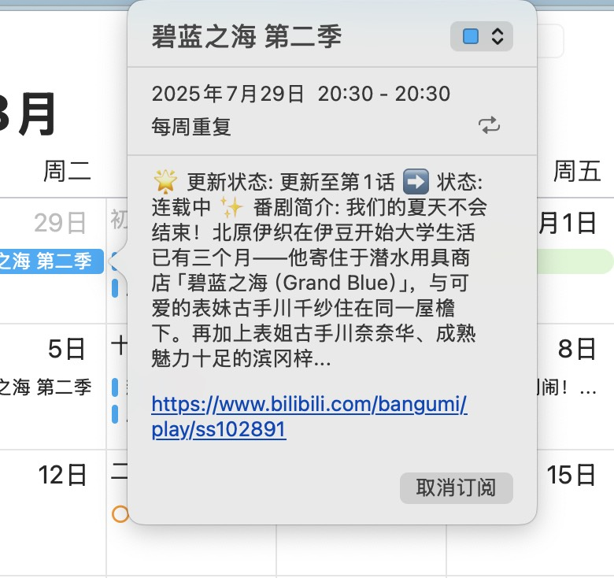

# Bili-Calendar (B站追番日历)  
[](https://app.netlify.com/projects/bili-calendar/deploys)
[](https://github.com/Silentely/bili-calendar/pkgs/container/bili-calendar)

> 🎉 **将B站追番列表一键转换为日历订阅，支持 Apple/Google/Outlook 等主流日历应用！**

---

## ✨ 功能特点

### 核心功能
- 📅 **自动同步**：B站追番列表一键生成日历订阅
- 🕒 **准确时间**：精确解析番剧更新时间，支持时区自动转换
- 🔁 **智能重复**：连载中番剧自动每周重复，完结番剧仅保留首播
- 📱 **多平台支持**：兼容 Apple/Google/Outlook 等所有支持 ICS 的日历应用
- 🚀 **简单易用**：只需提供 B站 UID 即可生成订阅链接
- 🔒 **隐私保护**：服务端不存储任何用户数据，支持自部署

### 🆕 新增功能（v2.0）
- 🌙 **暗黑模式**：自动跟随系统主题，支持手动切换，保护眼睛
- 👁️ **番剧预览**：订阅前预览所有追番内容，了解更新时间和状态
- 💾 **本地缓存**：智能缓存数据，减少API调用，提升响应速度
- 📝 **历史记录**：自动保存最近使用的10个UID，快速切换账号
- 📱 **PWA支持**：可安装为独立应用，支持离线访问
- 🎨 **增强UI/UX**：精美动画效果、加载状态、错误引导
- ⌨️ **键盘快捷键**：支持快捷操作，提升使用效率
- 📱 **移动优化**：完美适配移动设备，触摸优化

---

## 📸 效果预览

> 下图展示了全新的前端界面、暗黑模式、番剧预览和日历订阅效果：

| 浅色模式 | 暗黑模式 | 番剧预览 |
|:---:|:---:|:---:|
|  |  |  |

| 移动端界面 | 日历视图 | 事件详情 |
|:---:|:---:|:---:|
|  |  |  |

### 界面特点
- **响应式设计**：自动适配桌面和移动设备
- **流畅动画**：优雅的过渡效果和加载动画
- **智能提示**：详细的错误信息和解决方案
- **历史记录**：快速访问最近使用的账号

---

## 🚀 快速开始

### 公共服务（推荐）

1. 访问 [https://calendar.cosr.eu.org](https://calendar.cosr.eu.org)
2. 输入您的 B站 UID（在 B站个人空间网址中找到，例如：`https://space.bilibili.com/614500` 中的 614500）
3. 点击"生成订阅"按钮（或按 Enter 键）
4. （可选）点击"预览番剧"查看追番列表
5. 将生成的订阅链接添加到您的日历应用中  
PS: 也可直接通过 `https://calendar.cosr.eu.org/uid` 形式复制到日历新增订阅里填入链接

### 📲 PWA 安装指南

#### 桌面端（Chrome/Edge）
1. 访问网站后，地址栏右侧会出现安装图标
2. 点击安装图标，确认安装
3. 应用将作为独立窗口运行

#### 移动端（iOS）
1. 在 Safari 中打开网站
2. 点击分享按钮
3. 选择"添加到主屏幕"
4. 点击"添加"确认

#### 移动端（Android）
1. 在 Chrome 中打开网站
2. 点击右上角菜单
3. 选择"添加到主屏幕"
4. 确认安装

### ⌨️ 键盘快捷键

| 快捷键 | 功能 |
|--------|------|
| `Enter` | 生成订阅/执行操作 |
| `Ctrl/Cmd + K` | 聚焦搜索框 |
| `Ctrl/Cmd + P` | 预览番剧列表 |
| `Ctrl/Cmd + D` | 切换暗黑模式 |
| `Ctrl/Cmd + H` | 显示/隐藏历史记录 |
| `Ctrl/Cmd + C` | 复制订阅链接 |
| `Esc` | 关闭弹窗/清除输入 |

---

## 🛠️ 私有部署

### 使用 Docker（推荐）

```bash
# 创建 docker-compose.yml 文件
version: '3.8'
services:
  bili-calendar:
    image: ghcr.io/silentely/bili-calendar:latest
    ports:
      - "3000:3000"
    environment:
      - BILIBILI_COOKIE=  # 可选，用于提高API访问成功率
      - NODE_ENV=production
      - TZ=Asia/Shanghai
    restart: unless-stopped
    volumes:
      - ./logs:/app/logs  # 可选，用于持久化日志

# 启动服务
docker-compose up -d
```

### 手动部署

```bash
# 克隆仓库
git clone https://github.com/Silentely/bili-calendar.git
cd bili-calendar

# 安装依赖
npm install

# 启动服务
npm start

# 或者在开发模式下运行
npm run dev
```

---

## 📡 API 接口

### 获取用户追番日历

```
GET /:uid
```

参数：
- `uid`: B站用户 UID

返回：ICS 格式的日历文件

### 获取用户追番数据（JSON）

```
GET /api/bangumi/:uid
```

参数：
- `uid`: B站用户 UID

返回：B站追番列表的 JSON 数据

> **速率限制**：为防止滥用，API直接访问限制为每个IP每小时3次。项目内部调用不受此限制。API响应头中包含 `X-RateLimit-*` 系列字段，用于了解当前使用情况。

### 前端页面

```
GET /
```

返回：前端页面，用户可以输入 B站 UID 生成订阅链接

### 健康检查

```
GET /status
```

返回：服务状态信息，用于健康检查

---

## ⚙️ 配置说明

### 环境变量

| 变量名 | 默认值 | 说明 |
|--------|--------|------|
| `PORT` | 3000 | 服务监听端口 |
| `BILIBILI_COOKIE` | 空 | B站 Cookie，用于提高API访问成功率 |
| `NODE_ENV` | development | 运行环境（development/production） |
| `TZ` | Asia/Shanghai | 时区设置 |
| `API_RATE_LIMIT` | 3 | API调用速率限制（次数/时间窗口） |
| `API_RATE_WINDOW` | 3600000 | 速率限制时间窗口（毫秒，默认1小时） |
| `ENABLE_RATE_LIMIT` | true | 是否启用速率限制（true/false） |
| `HTTP_TIMEOUT_MS` | 10000 | HTTP请求超时时间（毫秒） |
| `HTTP_RETRY_MAX` | 2 | HTTP请求最大重试次数 |
| `HTTP_RETRY_BASE_DELAY_MS` | 300 | HTTP重试基础延迟时间（毫秒） |

### 注意事项

1. **隐私设置**：您的 B站追番列表必须设置为公开才能被获取
2. **Cookie 设置**：如果遇到访问频率限制，可以设置 `BILIBILI_COOKIE` 环境变量
3. **时区处理**：服务默认使用东八区时间（北京时间），请确保部署环境时区正确

---

## 🏗️ 技术架构

- **后端**：Node.js + Express
- **前端**：原生 HTML/CSS/JavaScript（ES6+）
- **容器化**：Docker + Docker Compose (amd64, arm64)
- **Serverless**：支持 Netlify Functions 部署
- **日历格式**：遵循 RFC 5545 标准的 ICS 格式
- **UI框架**：原生CSS + CSS变量 + 响应式设计
- **PWA**：Service Worker + Web App Manifest
- **缓存策略**：LocalStorage + Service Worker Cache API

---

## 💻 开发指南

### 项目结构

```
bili-calendar/
├── server.js              # Docker部署的主服务文件
├── main.js                # Docker部署的主应用逻辑
├── netlify.toml           # Netlify配置
├── .github/               # GitHub配置目录
│   └── workflows/         # GitHub Actions工作流配置
│       └── docker-build.yml # Docker镜像自动构建配置
├── netlify/               # Netlify函数目录
│   └── functions/         # 函数源代码
│       └── server.js      # Serverless版本的服务器
├── public/                # 静态文件目录
│   ├── index.html         # 前端页面
│   ├── styles.css         # 基础样式
│   ├── styles-dark.css    # 暗黑模式样式
│   ├── loading-animations.css # 加载动画样式
│   ├── error-guide.css    # 错误引导样式
│   ├── anime-preview.css  # 番剧预览样式
│   ├── cache-history.css  # 缓存历史样式
│   ├── mobile-enhancements.css # 移动端优化样式
│   ├── app.js             # 主应用逻辑
│   ├── error-handler.js   # 错误处理模块
│   ├── anime-preview.js   # 番剧预览模块
│   ├── cache-manager.js   # 缓存管理模块
│   ├── sw.js              # Service Worker
│   └── manifest.webmanifest # PWA清单文件
├── utils/                 # 工具函数目录
│   ├── time.js            # 时间处理工具
│   ├── ics.js             # ICS生成工具
│   └── http.js            # HTTP客户端工具
├── assets/                # 资源文件目录
│   └── icons/             # PWA图标
├── Dockerfile             # Docker 镜像配置
├── docker-compose.yml     # Docker Compose 配置
├── package.json           # Node.js 项目配置
├── IMPROVEMENTS.md        # 功能改进文档
└── README.md              # 项目说明文档
```

### 本地开发

```bash
# 安装依赖
npm install

# 启动开发服务器（支持热重载）
npm run dev

# 构建并启动生产服务器
npm run start:prod

# 运行测试
npm test
```

### 前端模块说明

| 模块 | 功能 | 文件 |
|------|------|------|
| 主应用 | 核心业务逻辑、主题切换 | `app.js` |
| 错误处理 | 智能错误提示和解决方案 | `error-handler.js` |
| 番剧预览 | 追番列表展示和筛选 | `anime-preview.js` |
| 缓存管理 | 数据缓存和历史记录 | `cache-manager.js` |
| PWA | 离线支持和应用安装 | `sw.js`, `manifest.webmanifest` |

---

## 🚀 部署指南

### 部署到云服务器

1. 克隆项目到服务器
2. 安装 Node.js 环境（建议使用 v18 或更高版本）
3. 安装 PM2 进程管理器：`npm install -g pm2`
4. 安装项目依赖：`npm install`
5. 启动服务：`pm2 start npm --name "bili-calendar" -- start`
6. 设置开机自启：`pm2 startup && pm2 save`

### 部署到 Netlify

1. 在 Netlify 导入 GitHub 仓库
2. 配置以下构建设置:
   - 构建命令: `npm run build`
   - 发布目录: `public`
   - 环境变量: 根据需要设置 `BILIBILI_COOKIE` 等
3. Netlify.toml 文件已包含必要配置:
   ```toml
   [build]
     command = "npm run build"
     publish = "public"
     functions = "netlify/functions-build"

   [[redirects]]
     from = "/*"
     to = "/.netlify/functions/server"
     status = 200
   ```
4. 本项目已包含所有必要的Netlify Functions配置，无需额外设置

> **注意**: 项目已通过 `serverless-http` 将Express应用包装为Netlify函数，并使用CommonJS模块格式，所有必要的依赖已添加到package.json中。

---

## 🔧 多平台部署说明

本项目支持多种部署方式，每种方式使用不同的代码实现以适应特定平台的要求：

### Docker部署
- 使用 `server.js` 和 `main.js` 作为主应用文件
- 包含完整的 Express 应用实现
- 适用于传统服务器部署或容器化部署

### Netlify Functions部署
- 使用 `netlify/functions/server.js` 作为函数入口
- 通过 `serverless-http` 将 Express 应用包装为无服务器函数
- 使用 CommonJS 模块系统以适应 Netlify 环境

### 各平台实现差异
1. **限流机制**：
   - Docker版本使用定时清理的限流机制
   - Netlify版本使用机会性清理的限流机制

2. **日志处理**：
   - 不同平台使用不同的日志格式以适应各自环境

3. **错误处理**：
   - 各平台针对特定错误场景进行了优化处理

4. **IP地址处理**：
   - Netlify版本包含更完善的IP地址处理逻辑

---

## ❓ 常见问题

### 为什么显示"[时间未知]"？

可能原因：
1. 番剧尚未公布具体更新时间
2. B站API返回的数据格式有变化
3. 网络问题导致API访问失败

### 如何获取 B站 UID？

1. 打开 B站个人空间页面（例如：`https://space.bilibili.com/614500`）
2. URL中的数字部分就是您的 UID（示例中为 614500）

### 如何更新日历？

日历订阅链接是动态生成的，会自动获取最新的追番列表。大多数日历应用会定期自动同步更新。

### 为什么有些番剧没有显示在日历中？

项目会自动过滤掉已经完结的番剧和没有明确播出时间的番剧。只有连载中且有明确播出时间的番剧才会显示在日历中。

### 如何清除缓存？

1. 打开浏览器开发者工具（F12）
2. 进入 Application/存储 标签
3. 清除 LocalStorage 和 Service Worker 缓存
4. 或者在设置中点击"清除所有缓存"按钮

### PWA无法安装？

确保：
1. 使用支持PWA的浏览器（Chrome、Edge、Safari等）
2. 网站使用HTTPS协议（本地开发除外）
3. 浏览器设置允许安装Web应用

---

## 🐛 故障排除

### 问题：API请求失败

**症状**：显示"网络错误"或"API访问受限"

**解决方案**：
1. 检查网络连接
2. 确认UID是否正确
3. 确认追番列表是否公开
4. 尝试刷新页面或清除缓存
5. 如果频繁出现，考虑自行部署并设置Cookie

### 问题：日历无法订阅

**症状**：日历应用提示错误或无法添加

**解决方案**：
1. 确认订阅链接格式正确
2. 检查日历应用是否支持ICS格式
3. 尝试使用网页版日历应用
4. 检查网络代理设置

### 问题：番剧时间显示错误

**症状**：更新时间与实际不符

**解决方案**：
1. 检查系统时区设置
2. 确认日历应用时区配置
3. 刷新订阅获取最新数据

### 问题：移动端体验不佳

**症状**：按钮太小、布局错乱

**解决方案**：
1. 更新到最新版本
2. 使用现代浏览器
3. 尝试安装PWA应用
4. 清除浏览器缓存

---

## 🤝 贡献指南

欢迎提交 Issue 和 Pull Request 来帮助改进本项目！

### 开发流程

1. Fork 项目
2. 创建功能分支：`git checkout -b feature/your-feature-name`
3. 提交更改：`git commit -am 'Add some feature'`
4. 推送到分支：`git push origin feature/your-feature-name`
5. 创建 Pull Request

### 代码规范

- 使用 ES6+ 语法
- 遵循语义化版本控制
- 添加必要的注释
- 确保代码通过测试
- 更新相关文档

### API 使用示例

```bash
# 获取用户追番数据
curl -X GET "http://localhost:3000/api/bangumi/614500" \
  -H "Accept: application/json"

# 生成ICS日历文件
curl -X GET "http://localhost:3000/614500.ics" \
  -H "Accept: text/calendar"

# 健康检查
curl -X GET "http://localhost:3000/status"
```

### 响应头说明

API响应包含以下速率限制相关头部信息：

- `X-RateLimit-Limit`: 每个时间窗口内的最大请求数
- `X-RateLimit-Remaining`: 当前时间窗口内剩余的请求数
- `X-RateLimit-Reset`: 当前时间窗口的重置时间（ISO 8601格式）

---

## 📝 更新日志

### v2.0.0 (2025-08)
- ✨ 新增暗黑模式支持
- ✨ 新增番剧预览功能
- ✨ 新增本地缓存和历史记录
- ✨ 新增PWA支持
- ✨ 新增键盘快捷键
- 🎨 全新UI设计
- 📱 优化移动端体验
- 🐛 修复多项已知问题
- ⚡ 性能优化

### v1.0.0 (2025-07)
- 🎉 初始版本发布
- 📅 基础日历订阅功能
- 🔁 智能重复规则
- 📱 多平台支持

---

## ⚖️ 免责声明

本项目仅供学习交流使用，不提供任何BiliBili相关的账号服务。请遵守BiliBili的相关服务条款和使用规范。

---

## 📄 License

- 本项目的所有代码除另有说明外,均按照 [MIT License](LICENSE) 发布。
- 本项目的README.MD，wiki等资源基于 [CC BY-NC-SA 4.0][CC-NC-SA-4.0] 这意味着你可以拷贝、并再发行本项目的内容，<br/>
  但是你将必须同样**提供原作者信息以及协议声明**。同时你也**不能将本项目用于商业用途**，按照我们狭义的理解<br/>
  (增加附属条款)，凡是**任何盈利的活动皆属于商业用途**。
- 请在遵守当地相关法律法规的前提下使用本项目。

<p align="center">
  
</p>

[github-hosts]: https://raw.githubusercontent.com/racaljk/hosts/master/hosts "hosts on Github"
[CC-NC-SA-4.0]: https://creativecommons.org/licenses/by-nc-sa/4.0/deed.zh

<div align="center">
  <sub>Made with ❤️ by <a href="https://github.com/Silentely">Silentely</a></sub>
</div>