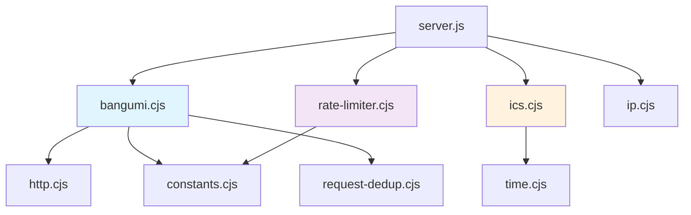

# Utils 模块文档

> **导航**: [← 返回根目录](../CLAUDE.md) | **模块**: 后端工具层

---

## 📋 模块概览

**Utils** 模块是 Bili-Calendar 的后端核心工具层，提供 B站 API 调用、ICS 文件生成、请求限流、去重、时间处理等基础功能。采用 CommonJS 模块系统，确保与 Node.js 服务器的兼容性。

### 核心职责

- 🌐 B站 API 数据获取与解析
- 📅 ICS 日历文件生成
- 🚦 请求速率限制 (Rate Limiting)
- 🔄 请求去重 (Request Deduplication)
- ⏰ 时间解析与格式化
- 🌍 HTTP 请求封装
- 🔧 常量与配置管理

---

## 📁 文件结构

```
utils/
├── 📄 bangumi.cjs              # B站番剧数据获取
├── 📄 ics.cjs                  # ICS 日历文件生成
├── 📄 rate-limiter.cjs         # 请求速率限制
├── 📄 request-dedup.cjs        # 请求去重
├── 📄 time.cjs                 # 时间处理工具
├── 📄 http.cjs                 # HTTP 请求工具
├── 📄 constants.cjs            # 常量定义
├── 📄 ip.cjs                   # IP 提取工具
└── 📄 bangumi.js               # (废弃) ES Module 版本
```

---

## 🔑 核心文件详解

### 1. `bangumi.cjs` - B站番剧数据获取

**职责**: 从 B站 API 获取用户追番列表并过滤正在播出的番剧

**核心函数**:

#### `getBangumiData(uid)`

获取用户追番数据并自动过滤正在播出的番剧。

**参数**:
- `uid` (string|number): B站用户 UID，必须是纯数字

**返回值**:
```javascript
// 成功
{
  code: 0,
  data: {
    list: Array,      // 番剧列表
    total: number     // 总数
  },
  filtered: true,
  filtered_count: number,    // 过滤后数量
  original_count: number     // 原始数量
}

// 业务错误
{
  code: number,
  message: string,
  error: string
}

// 网络/系统错误
null
```

**使用示例**:
```javascript
const { getBangumiData } = require('./utils/bangumi.cjs');

const data = await getBangumiData('614500');

if (data && data.code === 0) {
  console.log(`找到 ${data.filtered_count} 部正在播出的番剧`);
  data.data.list.forEach(bangumi => {
    console.log(`- ${bangumi.title}`);
  });
} else if (data && data.error === 'Privacy Settings') {
  console.log('该用户的追番列表已设为隐私');
} else {
  console.log('获取数据失败');
}
```

**过滤逻辑**:
```javascript
// 过滤条件：
// 1. is_finish === 0 (未完结)
// 2. 具有播出时间信息 (pub_index 或 renewal_time 或 new_ep.pub_time)

const currentlyAiring = bangumis.filter(bangumi => {
  const isOngoing = bangumi.is_finish === 0;
  const hasBroadcastInfo =
    (bangumi.pub_index && bangumi.pub_index.trim() !== '') ||
    (bangumi.renewal_time && bangumi.renewal_time.trim() !== '') ||
    (bangumi.new_ep?.pub_time && bangumi.new_ep.pub_time.trim() !== '');

  return isOngoing && hasBroadcastInfo;
});
```

**错误处理**:
- **隐私设置错误** (code: -352): 用户追番列表设为隐私
- **网络错误**: 返回 null
- **API 错误**: 返回原始错误对象

**依赖**:
- `http.cjs` - HTTP 请求客户端
- `constants.cjs` - API 常量
- `request-dedup.cjs` - 请求去重

---

### 2. `ics.cjs` - ICS 日历文件生成

**职责**: 将番剧数据转换为 ICS 格式的日历文件

**核心函数**:

#### `generateICS(bangumis, uid)`

生成 ICS 日历文件内容。

**参数**:
- `bangumis` (Array): 番剧列表
- `uid` (string): 用户 UID

**返回值**:
- `string`: ICS 格式的日历文件内容

**ICS 文件结构**:
```
BEGIN:VCALENDAR
VERSION:2.0
PRODID:-//BiliCalendar//EN
CALSCALE:GREGORIAN
METHOD:PUBLISH
X-WR-CALNAME:B站追番 (UID: 614500)
X-WR-TIMEZONE:Asia/Shanghai

BEGIN:VTIMEZONE
TZID:Asia/Shanghai
...
END:VTIMEZONE

BEGIN:VEVENT
UID:12345@bilibili.com
DTSTAMP:20251122T074927Z
DTSTART;TZID=Asia/Shanghai:20251123T120000
RRULE:FREQ=WEEKLY;COUNT=2;BYDAY=SA
SUMMARY:某某番剧 第一季
DESCRIPTION:🌟 更新状态: 更新至第12话 ➡️ 状态: 连载中 ✨ 番剧简介: ...
URL;VALUE=URI:https://www.bilibili.com/bangumi/play/ss12345
END:VEVENT

...

END:VCALENDAR
```

**事件生成逻辑**:

1. **解析播出时间**:
```javascript
// 优先级: pub_index > new_ep.pub_time > renewal_time
let info = parseBroadcastTime(item.pub_index);
if (!info && item?.new_ep?.pub_time) {
  info = parseNewEpTime(item.new_ep.pub_time);
}
if (!info && item?.renewal_time) {
  info = parseBroadcastTime(item.renewal_time);
}
```

2. **生成重复规则**:
```javascript
// 连载中番剧: 每周重复 2 次
if (item.is_finish === 0) {
  eventLines.push(`RRULE:FREQ=WEEKLY;COUNT=2;BYDAY=${info.rruleDay}`);
}
// 已完结番剧: 不重复，仅保留首播
```

3. **事件描述**:
```javascript
let description = '';
if (item.index_show) {
  description += `🌟 更新状态: ${item.index_show}`;
}
description += ` ➡️ 状态: ${item.is_finish === 0 ? '连载中' : '已完结'}`;
description += ` ✨ 番剧简介: ${item.evaluate || '暂无简介'}`;
```

#### `respondWithICS(res, icsContent, uid)`

发送 ICS 文件响应。

**参数**:
- `res` (Response): Express 响应对象
- `icsContent` (string): ICS 文件内容
- `uid` (string): 用户 UID

**响应头**:
```javascript
{
  'Content-Type': 'text/calendar; charset=utf-8',
  'Content-Disposition': `attachment; filename="bilibili-bangumi-${uid}.ics"`,
  'Cache-Control': 'public, max-age=3600',
  'X-Content-Type-Options': 'nosniff'
}
```

#### `respondWithEmptyCalendar(res, uid, reason)`

发送空日历响应（当没有番剧时）。

**依赖**:
- `time.cjs` - 时间解析与格式化

---

### 3. `rate-limiter.cjs` - 请求速率限制

**职责**: 基于 IP 的请求速率限制，防止滥用

**核心类**:

#### `RateLimiter`

**配置**:
```javascript
{
  windowMs: 15 * 60 * 1000,  // 时间窗口: 15 分钟
  maxRequests: 100,          // 最大请求数: 100 次
  message: '请求过于频繁，请稍后再试'
}
```

**数据结构**:
```javascript
// 存储格式: Map<IP, RequestRecord>
{
  count: number,        // 当前窗口内的请求次数
  resetTime: number,    // 窗口重置时间 (时间戳)
  firstRequest: number  // 首次请求时间 (时间戳)
}
```

**核心方法**:

##### `check(ip)`

检查 IP 是否超过速率限制。

**返回值**:
```javascript
{
  allowed: boolean,      // 是否允许请求
  remaining: number,     // 剩余请求次数
  resetTime: number,     // 窗口重置时间
  retryAfter: number     // 重试等待时间 (秒)
}
```

**使用示例**:
```javascript
const { createRateLimiter } = require('./utils/rate-limiter.cjs');

const rateLimiter = createRateLimiter();

app.use((req, res, next) => {
  const ip = extractClientIP(req);
  const result = rateLimiter.check(ip);

  if (!result.allowed) {
    return res.status(429).json({
      error: 'Too Many Requests',
      message: '请求过于频繁，请稍后再试',
      retryAfter: result.retryAfter
    });
  }

  // 设置响应头
  res.set({
    'X-RateLimit-Limit': 100,
    'X-RateLimit-Remaining': result.remaining,
    'X-RateLimit-Reset': new Date(result.resetTime).toISOString()
  });

  next();
});
```

##### `cleanup()`

清理过期的限流记录。

```javascript
// 定期清理 (每小时一次)
setInterval(() => rateLimiter.cleanup(), 60 * 60 * 1000);
```

**算法**:
- **滑动窗口**: 每个 IP 独立计数
- **自动重置**: 窗口过期后自动重置计数
- **内存管理**: 定期清理过期记录

---

### 4. `request-dedup.cjs` - 请求去重

**职责**: 防止相同请求并发执行，减少 API 调用

**核心类**:

#### `RequestDedup`

**数据结构**:
```javascript
// 存储格式: Map<Key, Promise>
{
  key: string,           // 请求唯一标识
  promise: Promise,      // 正在执行的 Promise
  timestamp: number      // 请求开始时间
}
```

**核心方法**:

##### `dedupe(key, fn)`

对请求进行去重处理。

**参数**:
- `key` (string): 请求唯一标识 (如 `bangumi:614500`)
- `fn` (Function): 异步函数

**返回值**:
- `Promise`: 请求结果

**使用示例**:
```javascript
const { createRequestDedup } = require('./utils/request-dedup.cjs');

const dedupManager = createRequestDedup();

async function getBangumiData(uid) {
  // 使用请求去重
  return dedupManager.dedupe(`bangumi:${uid}`, async () => {
    const response = await fetch(`https://api.bilibili.com/...`);
    return response.json();
  });
}

// 并发调用相同 UID，只会执行一次 API 请求
Promise.all([
  getBangumiData('614500'),
  getBangumiData('614500'),
  getBangumiData('614500')
]).then(results => {
  // 三个结果相同，但只调用了一次 API
  console.log(results);
});
```

**工作原理**:
1. 检查是否有相同 key 的请求正在执行
2. 如果有，直接返回现有 Promise
3. 如果没有，执行新请求并缓存 Promise
4. 请求完成后，清理缓存

**优势**:
- 减少重复 API 调用
- 降低服务器负载
- 提升响应速度

---

### 5. `time.cjs` - 时间处理工具

**职责**: 时间解析、格式化、时区转换

**核心函数**:

#### `parseBroadcastTime(timeStr)`

解析播出时间字符串。

**支持格式**:
- `"每周六 12:00"` → `{ dayOfWeek: 6, time: '12:00', rruleDay: 'SA' }`
- `"周日 18:30"` → `{ dayOfWeek: 0, time: '18:30', rruleDay: 'SU' }`
- `"星期三 20:00"` → `{ dayOfWeek: 3, time: '20:00', rruleDay: 'WE' }`

**返回值**:
```javascript
{
  dayOfWeek: number,    // 0-6 (周日-周六)
  time: string,         // HH:MM 格式
  rruleDay: string      // RRULE 格式 (SU, MO, TU, WE, TH, FR, SA)
}
```

#### `parseNewEpTime(timeStr)`

解析新集播出时间。

**支持格式**:
- `"2025-11-23 12:00:00"` → `{ dayOfWeek: 6, time: '12:00', rruleDay: 'SA' }`

#### `getNextBroadcastDate(dayOfWeek, time)`

计算下次播出日期。

**参数**:
- `dayOfWeek` (number): 星期几 (0-6)
- `time` (string): 时间 (HH:MM)

**返回值**:
- `Date`: 下次播出的日期时间

**算法**:
```javascript
function getNextBroadcastDate(dayOfWeek, time) {
  const now = new Date();
  const [hours, minutes] = time.split(':').map(Number);

  // 计算目标日期
  let targetDate = new Date(now);
  targetDate.setHours(hours, minutes, 0, 0);

  // 计算天数差
  const currentDay = now.getDay();
  let daysUntilTarget = dayOfWeek - currentDay;

  if (daysUntilTarget < 0 || (daysUntilTarget === 0 && now >= targetDate)) {
    daysUntilTarget += 7;
  }

  targetDate.setDate(now.getDate() + daysUntilTarget);
  return targetDate;
}
```

#### `formatDate(date)`

格式化日期为 ICS 格式。

**输入**: `Date` 对象
**输出**: `"20251123T120000"` (YYYYMMDDTHHmmss)

#### `escapeICSText(text)`

转义 ICS 文本中的特殊字符。

**转义规则**:
- `,` → `\,`
- `;` → `\;`
- `\n` → `\n` (保留换行)
- `\` → `\\`

---

### 6. `http.cjs` - HTTP 请求工具

**职责**: 封装 HTTP 请求客户端，提供统一的请求接口

**核心对象**:

#### `httpClient`

基于 `axios` 的 HTTP 客户端实例。

**配置**:
```javascript
{
  timeout: 10000,              // 超时时间: 10 秒
  headers: {
    'User-Agent': 'BiliCalendar/1.1.8',
    'Referer': 'https://www.bilibili.com'
  },
  validateStatus: (status) => status < 500  // 4xx 不抛出异常
}
```

**Serverless 环境优化**:
```javascript
// 在 Netlify/Vercel 等 Serverless 环境中禁用连接池
if (process.env.NETLIFY || process.env.VERCEL) {
  httpClient.defaults.httpAgent = new http.Agent({ keepAlive: false });
  httpClient.defaults.httpsAgent = new https.Agent({ keepAlive: false });
}
```

**使用示例**:
```javascript
const { httpClient } = require('./utils/http.cjs');

// GET 请求
const response = await httpClient.get('https://api.bilibili.com/...');

// POST 请求
const response = await httpClient.post('https://api.bilibili.com/...', {
  data: { ... }
});

// 自定义配置
const response = await httpClient.get('https://api.bilibili.com/...', {
  timeout: 5000,
  headers: { 'Custom-Header': 'value' }
});
```

**错误处理**:
```javascript
try {
  const response = await httpClient.get(url);
  console.log(response.data);
} catch (error) {
  if (error.response) {
    // HTTP 错误 (4xx, 5xx)
    console.error('HTTP Error:', error.response.status);
  } else if (error.request) {
    // 网络错误
    console.error('Network Error:', error.message);
  } else {
    // 其他错误
    console.error('Error:', error.message);
  }
}
```

---

### 7. `constants.cjs` - 常量定义

**职责**: 集中管理项目常量

**常量列表**:

```javascript
module.exports = {
  // B站 API
  BILIBILI_API_BASE_URL: 'https://api.bilibili.com',
  BILIBILI_API_SUCCESS_CODE: 0,
  BILIBILI_PRIVACY_ERROR_CODE: -352,

  // 速率限制
  RATE_LIMIT_WINDOW_MS: 15 * 60 * 1000,  // 15 分钟
  RATE_LIMIT_MAX_REQUESTS: 100,          // 100 次

  // 缓存
  CACHE_TTL: 24 * 60 * 60 * 1000,        // 24 小时

  // 时区
  DEFAULT_TIMEZONE: 'Asia/Shanghai',

  // 星期映射
  DAY_MAP: {
    '日': 0, '一': 1, '二': 2, '三': 3,
    '四': 4, '五': 5, '六': 6
  },

  // RRULE 星期映射
  RRULE_DAY_MAP: ['SU', 'MO', 'TU', 'WE', 'TH', 'FR', 'SA']
};
```

---

### 8. `ip.cjs` - IP 提取工具

**职责**: 从请求中提取客户端真实 IP

**核心函数**:

#### `extractClientIP(req)`

提取客户端 IP 地址。

**优先级**:
1. `X-Forwarded-For` (代理/CDN)
2. `X-Real-IP` (Nginx)
3. `req.ip` (Express)
4. `req.connection.remoteAddress` (原始连接)

**返回值**:
- `string`: 客户端 IP 地址

**使用示例**:
```javascript
const { extractClientIP } = require('./utils/ip.cjs');

app.use((req, res, next) => {
  const ip = extractClientIP(req);
  console.log('Client IP:', ip);
  next();
});
```

#### `generateRequestId()`

生成唯一请求 ID。

**返回值**:
- `string`: 16 位随机字符串

**使用示例**:
```javascript
const { generateRequestId } = require('./utils/ip.cjs');

app.use((req, res, next) => {
  req.id = generateRequestId();
  res.set('X-Request-ID', req.id);
  next();
});
```

---

## 🔄 模块依赖关系



---

## 🧪 测试覆盖

### 已测试模块

- ✅ `ics.cjs` - ICS 生成逻辑
- ✅ `time.cjs` - 时间解析与格式化
- ✅ `rate-limiter.cjs` - 速率限制器
- ✅ `request-dedup.cjs` - 请求去重

### 测试文件

- `test/utils.ics.test.js`
- `test/utils.time.test.js`
- `test/utils.rate-limiter.test.js`
- `test/utils.request-dedup.test.js`

---

## 📊 性能优化

### 1. 请求去重
- 防止并发相同请求
- 减少 API 调用次数
- 降低服务器负载

### 2. 速率限制
- 基于 IP 的限流
- 滑动窗口算法
- 自动清理过期记录

### 3. HTTP 连接池
- 复用 TCP 连接
- Serverless 环境禁用 (避免连接泄漏)

### 4. 错误处理
- 详细的错误日志
- 友好的错误提示
- 自动重试机制 (可选)

---

## 🔗 相关链接

- [← 返回根目录](../CLAUDE.md)
- [前端模块文档](../public/CLAUDE.md)
- [测试文档](../test/CLAUDE.md)

---

**最后更新**: 2025-11-22 15:49:27 UTC
