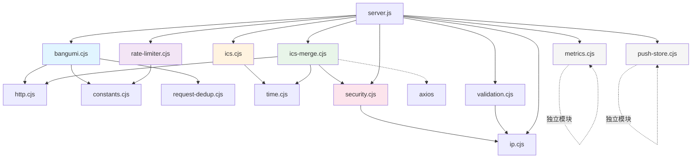

# Utils 模块文档

> **导航**: [← 返回根目录](../CLAUDE.md) | **模块**: 后端工具层

---

## 📋 模块概览

**Utils** 模块是 Bili-Calendar 的后端核心工具层，提供 B站 API 调用、ICS 文件生成、请求限流、去重、时间处理、安全校验、性能指标采集等基础功能。采用 CommonJS 模块系统，确保与 Node.js 服务器的兼容性。

### 核心职责

- 🌐 B站 API 数据获取与解析
- 📅 ICS 日历文件生成与多源合并
- 🚦 请求速率限制 (Rate Limiting)
- 🔄 请求去重 (Request Deduplication)
- ⏰ 时间解析与格式化
- 🌍 HTTP 请求封装
- 🔧 常量与配置管理
- 🛡️ 安全校验与 SSRF 防护
- 📊 性能指标采集
- 📲 WebPush 订阅存储
- ✅ 统一输入验证

---

## 📁 文件结构

```
utils/
├── bangumi.cjs              # B站番剧数据获取
├── bangumi.js               # (废弃) ES Module 版本
├── constants.cjs            # 常量定义
├── http.cjs                 # HTTP 请求工具
├── ics-merge.cjs            # 多源 ICS 合并与冲突检测
├── ics.cjs                  # ICS 日历文件生成
├── ip.cjs                   # IP 提取工具
├── metrics.cjs              # 性能指标采集
├── push-store.cjs           # WebPush 订阅存储
├── rate-limiter.cjs         # 请求速率限制
├── request-dedup.cjs        # 请求去重
├── security.cjs             # 安全校验（UID 验证、SSRF 防护）
├── time.cjs                 # 时间处理工具
├── validation.cjs           # 输入验证工具
└── CLAUDE.md                # 本文件
```

---

## 🔑 核心文件详解

### 1. `bangumi.cjs` - B站番剧数据获取

**职责**: 从 B站 API 获取用户追番列表并过滤正在播出的番剧

**核心函数**:

#### `getBangumiData(uid)`

获取用户追番数据并自动过滤正在播出的番剧。

**参数**:
- `uid` (string|number): B站用户 UID，必须是纯数字

**返回值**:
```javascript
// 成功
{
  code: 0,
  data: {
    list: Array,      // 番剧列表
    total: number     // 总数
  },
  filtered: true,
  filtered_count: number,    // 过滤后数量
  original_count: number     // 原始数量
}

// 业务错误
{
  code: number,
  message: string,
  error: string
}

// 网络/系统错误
null
```

**使用示例**:
```javascript
const { getBangumiData } = require('./utils/bangumi.cjs');

const data = await getBangumiData('614500');

if (data && data.code === 0) {
  console.log(`找到 ${data.filtered_count} 部正在播出的番剧`);
  data.data.list.forEach(bangumi => {
    console.log(`- ${bangumi.title}`);
  });
} else if (data && data.error === 'Privacy Settings') {
  console.log('该用户的追番列表已设为隐私');
} else {
  console.log('获取数据失败');
}
```

**过滤逻辑**:
```javascript
// 过滤条件：
// 1. is_finish === 0 (未完结)
// 2. 具有播出时间信息 (pub_index 或 renewal_time 或 new_ep.pub_time)

const currentlyAiring = bangumis.filter(bangumi => {
  const isOngoing = bangumi.is_finish === 0;
  const hasBroadcastInfo =
    (bangumi.pub_index && bangumi.pub_index.trim() !== '') ||
    (bangumi.renewal_time && bangumi.renewal_time.trim() !== '') ||
    (bangumi.new_ep?.pub_time && bangumi.new_ep.pub_time.trim() !== '');

  return isOngoing && hasBroadcastInfo;
});
```

**错误处理**:
- **隐私设置错误** (code: -352): 用户追番列表设为隐私
- **网络错误**: 返回 null
- **API 错误**: 返回原始错误对象

**依赖**:
- `http.cjs` - HTTP 请求客户端
- `constants.cjs` - API 常量
- `request-dedup.cjs` - 请求去重

---

### 2. `ics.cjs` - ICS 日历文件生成

**职责**: 将番剧数据转换为 ICS 格式的日历文件

**核心函数**:

#### `generateICS(bangumis, uid)`

生成 ICS 日历文件内容。

**参数**:
- `bangumis` (Array): 番剧列表
- `uid` (string): 用户 UID

**返回值**:
- `string`: ICS 格式的日历文件内容

**ICS 文件结构**:
```
BEGIN:VCALENDAR
VERSION:2.0
PRODID:-//BiliCalendar//EN
CALSCALE:GREGORIAN
METHOD:PUBLISH
X-WR-CALNAME:B站追番 (UID: 614500)
X-WR-TIMEZONE:Asia/Shanghai

BEGIN:VTIMEZONE
TZID:Asia/Shanghai
...
END:VTIMEZONE

BEGIN:VEVENT
UID:12345@bilibili.com
DTSTAMP:20251122T074927Z
DTSTART;TZID=Asia/Shanghai:20251123T120000
RRULE:FREQ=WEEKLY;COUNT=2;BYDAY=SA
SUMMARY:某某番剧 第一季
DESCRIPTION:🌟 更新状态: 更新至第12话 ➡️ 状态: 连载中 ✨ 番剧简介: ...
URL;VALUE=URI:https://www.bilibili.com/bangumi/play/ss12345
END:VEVENT

...

END:VCALENDAR
```

**事件生成逻辑**:

1. **解析播出时间**:
```javascript
// 优先级: pub_index > new_ep.pub_time > renewal_time
let info = parseBroadcastTime(item.pub_index);
if (!info && item?.new_ep?.pub_time) {
  info = parseNewEpTime(item.new_ep.pub_time);
}
if (!info && item?.renewal_time) {
  info = parseBroadcastTime(item.renewal_time);
}
```

2. **生成重复规则**:
```javascript
// 连载中番剧: 每周重复 2 次
if (item.is_finish === 0) {
  eventLines.push(`RRULE:FREQ=WEEKLY;COUNT=2;BYDAY=${info.rruleDay}`);
}
// 已完结番剧: 不重复，仅保留首播
```

3. **事件描述**:
```javascript
let description = '';
if (item.index_show) {
  description += `🌟 更新状态: ${item.index_show}`;
}
description += ` ➡️ 状态: ${item.is_finish === 0 ? '连载中' : '已完结'}`;
description += ` ✨ 番剧简介: ${item.evaluate || '暂无简介'}`;
```

#### `respondWithICS(res, icsContent, uid)`

发送 ICS 文件响应。

**参数**:
- `res` (Response): Express 响应对象
- `icsContent` (string): ICS 文件内容
- `uid` (string): 用户 UID

**响应头**:
```javascript
{
  'Content-Type': 'text/calendar; charset=utf-8',
  'Content-Disposition': `attachment; filename="bilibili-bangumi-${uid}.ics"`,
  'Cache-Control': 'public, max-age=3600',
  'X-Content-Type-Options': 'nosniff'
}
```

#### `respondWithEmptyCalendar(res, uid, reason)`

发送空日历响应（当没有番剧时）。

**依赖**:
- `time.cjs` - 时间解析与格式化

---

### 3. `ics-merge.cjs` - 多源 ICS 合并与冲突检测

**职责**: 拉取外部 ICS 源，合并到 B站追番日历，支持冲突检测与 DNS 安全查询

**核心功能**:

#### `safeLookup(hostname)`

安全的 DNS 查询，防止 DNS 重绑定攻击。

**参数**:
- `hostname` (string): 主机名

**返回值**:
- `Promise<string>`: 解析后的 IP 地址

**安全机制**:
- 使用 `dns.lookup` 解析主机名
- 结合 `security.cjs` 的 `isPrivateIPAddress` 检测私有地址
- 阻止对内网地址的请求，防止 SSRF

#### `fetchExternalICS(url)`

拉取外部 ICS 源内容。

**参数**:
- `url` (string): 外部 ICS 链接

**返回值**:
- `Promise<string|null>`: ICS 内容或 null（失败时）

**处理流程**:
1. 解析 URL，提取主机名
2. 调用 `safeLookup` 验证 DNS 解析结果
3. 使用 `httpClient` 拉取 ICS 内容
4. 返回原始 ICS 文本

#### `mergeICS(bangumiICS, externalICSList)`

合并多个 ICS 源为一个日历文件。

**参数**:
- `bangumiICS` (string): B站追番 ICS 内容
- `externalICSList` (Array<string>): 外部 ICS 内容列表

**返回值**:
- `string`: 合并后的 ICS 内容

**合并策略**:
- 保留 B站 ICS 的日历头部（VCALENDAR、VTIMEZONE）
- 从外部源中提取 VEVENT 块
- 通过 UID 去重，避免重复事件
- 将外部事件追加到 B站事件之后

**依赖**:
- `axios` - HTTP 请求
- `dns` - DNS 查询（Node.js 内置）
- `security.cjs` - 私有地址检测
- `time.cjs` - 时间处理

---

### 4. `rate-limiter.cjs` - 请求速率限制

**职责**: 基于 IP 的请求速率限制，防止滥用

**核心类**:

#### `RateLimiter`

**配置**:
```javascript
{
  windowMs: 15 * 60 * 1000,  // 时间窗口: 15 分钟
  maxRequests: 100,          // 最大请求数: 100 次
  message: '请求过于频繁，请稍后再试'
}
```

**数据结构**:
```javascript
// 存储格式: Map<IP, RequestRecord>
{
  count: number,        // 当前窗口内的请求次数
  resetTime: number,    // 窗口重置时间 (时间戳)
  firstRequest: number  // 首次请求时间 (时间戳)
}
```

**核心方法**:

##### `check(ip)`

检查 IP 是否超过速率限制。

**返回值**:
```javascript
{
  allowed: boolean,      // 是否允许请求
  remaining: number,     // 剩余请求次数
  resetTime: number,     // 窗口重置时间
  retryAfter: number     // 重试等待时间 (秒)
}
```

**使用示例**:
```javascript
const { createRateLimiter } = require('./utils/rate-limiter.cjs');

const rateLimiter = createRateLimiter();

app.use((req, res, next) => {
  const ip = extractClientIP(req);
  const result = rateLimiter.check(ip);

  if (!result.allowed) {
    return res.status(429).json({
      error: 'Too Many Requests',
      message: '请求过于频繁，请稍后再试',
      retryAfter: result.retryAfter
    });
  }

  // 设置响应头
  res.set({
    'X-RateLimit-Limit': 100,
    'X-RateLimit-Remaining': result.remaining,
    'X-RateLimit-Reset': new Date(result.resetTime).toISOString()
  });

  next();
});
```

##### `cleanup()`

清理过期的限流记录。

```javascript
// 定期清理 (每小时一次)
setInterval(() => rateLimiter.cleanup(), 60 * 60 * 1000);
```

**算法**:
- **滑动窗口**: 每个 IP 独立计数
- **自动重置**: 窗口过期后自动重置计数
- **内存管理**: 定期清理过期记录

---

### 5. `request-dedup.cjs` - 请求去重

**职责**: 防止相同请求并发执行，减少 API 调用

**核心类**:

#### `RequestDedup`

**数据结构**:
```javascript
// 存储格式: Map<Key, Promise>
{
  key: string,           // 请求唯一标识
  promise: Promise,      // 正在执行的 Promise
  timestamp: number      // 请求开始时间
}
```

**核心方法**:

##### `dedupe(key, fn)`

对请求进行去重处理。

**参数**:
- `key` (string): 请求唯一标识 (如 `bangumi:614500`)
- `fn` (Function): 异步函数

**返回值**:
- `Promise`: 请求结果

**使用示例**:
```javascript
const { createRequestDedup } = require('./utils/request-dedup.cjs');

const dedupManager = createRequestDedup();

async function getBangumiData(uid) {
  // 使用请求去重
  return dedupManager.dedupe(`bangumi:${uid}`, async () => {
    const response = await fetch(`https://api.bilibili.com/...`);
    return response.json();
  });
}

// 并发调用相同 UID，只会执行一次 API 请求
Promise.all([
  getBangumiData('614500'),
  getBangumiData('614500'),
  getBangumiData('614500')
]).then(results => {
  // 三个结果相同，但只调用了一次 API
  console.log(results);
});
```

**工作原理**:
1. 检查是否有相同 key 的请求正在执行
2. 如果有，直接返回现有 Promise
3. 如果没有，执行新请求并缓存 Promise
4. 请求完成后，清理缓存

**优势**:
- 减少重复 API 调用
- 降低服务器负载
- 提升响应速度

---

### 6. `time.cjs` - 时间处理工具

**职责**: 时间解析、格式化、时区转换

**核心函数**:

#### `parseBroadcastTime(timeStr)`

解析播出时间字符串。

**支持格式**:
- `"每周六 12:00"` → `{ dayOfWeek: 6, time: '12:00', rruleDay: 'SA' }`
- `"周日 18:30"` → `{ dayOfWeek: 0, time: '18:30', rruleDay: 'SU' }`
- `"星期三 20:00"` → `{ dayOfWeek: 3, time: '20:00', rruleDay: 'WE' }`

**返回值**:
```javascript
{
  dayOfWeek: number,    // 0-6 (周日-周六)
  time: string,         // HH:MM 格式
  rruleDay: string      // RRULE 格式 (SU, MO, TU, WE, TH, FR, SA)
}
```

#### `parseNewEpTime(timeStr)`

解析新集播出时间。

**支持格式**:
- `"2025-11-23 12:00:00"` → `{ dayOfWeek: 6, time: '12:00', rruleDay: 'SA' }`

#### `getNextBroadcastDate(dayOfWeek, time)`

计算下次播出日期。

**参数**:
- `dayOfWeek` (number): 星期几 (0-6)
- `time` (string): 时间 (HH:MM)

**返回值**:
- `Date`: 下次播出的日期时间

**算法**:
```javascript
function getNextBroadcastDate(dayOfWeek, time) {
  const now = new Date();
  const [hours, minutes] = time.split(':').map(Number);

  // 计算目标日期
  let targetDate = new Date(now);
  targetDate.setHours(hours, minutes, 0, 0);

  // 计算天数差
  const currentDay = now.getDay();
  let daysUntilTarget = dayOfWeek - currentDay;

  if (daysUntilTarget < 0 || (daysUntilTarget === 0 && now >= targetDate)) {
    daysUntilTarget += 7;
  }

  targetDate.setDate(now.getDate() + daysUntilTarget);
  return targetDate;
}
```

#### `formatDate(date)`

格式化日期为 ICS 格式。

**输入**: `Date` 对象
**输出**: `"20251123T120000"` (YYYYMMDDTHHmmss)

#### `escapeICSText(text)`

转义 ICS 文本中的特殊字符。

**转义规则**:
- `,` → `\,`
- `;` → `\;`
- `\n` → `\n` (保留换行)
- `\` → `\\`

---

### 7. `http.cjs` - HTTP 请求工具

**职责**: 封装 HTTP 请求客户端，提供统一的请求接口

**核心对象**:

#### `httpClient`

基于 `axios` 的 HTTP 客户端实例。

**配置**:
```javascript
{
  timeout: 10000,              // 超时时间: 10 秒
  headers: {
    'User-Agent': 'BiliCalendar/1.1.8',
    'Referer': 'https://www.bilibili.com'
  },
  validateStatus: (status) => status < 500  // 4xx 不抛出异常
}
```

**Serverless 环境优化**:
```javascript
// 在 Netlify/Vercel 等 Serverless 环境中禁用连接池
if (process.env.NETLIFY || process.env.VERCEL) {
  httpClient.defaults.httpAgent = new http.Agent({ keepAlive: false });
  httpClient.defaults.httpsAgent = new https.Agent({ keepAlive: false });
}
```

**使用示例**:
```javascript
const { httpClient } = require('./utils/http.cjs');

// GET 请求
const response = await httpClient.get('https://api.bilibili.com/...');

// POST 请求
const response = await httpClient.post('https://api.bilibili.com/...', {
  data: { ... }
});

// 自定义配置
const response = await httpClient.get('https://api.bilibili.com/...', {
  timeout: 5000,
  headers: { 'Custom-Header': 'value' }
});
```

**错误处理**:
```javascript
try {
  const response = await httpClient.get(url);
  console.log(response.data);
} catch (error) {
  if (error.response) {
    // HTTP 错误 (4xx, 5xx)
    console.error('HTTP Error:', error.response.status);
  } else if (error.request) {
    // 网络错误
    console.error('Network Error:', error.message);
  } else {
    // 其他错误
    console.error('Error:', error.message);
  }
}
```

---

### 8. `constants.cjs` - 常量定义

**职责**: 集中管理项目常量

**常量列表**:

```javascript
module.exports = {
  // B站 API
  BILIBILI_API_BASE_URL: 'https://api.bilibili.com',
  BILIBILI_API_SUCCESS_CODE: 0,
  BILIBILI_PRIVACY_ERROR_CODE: -352,

  // 速率限制
  RATE_LIMIT_WINDOW_MS: 15 * 60 * 1000,  // 15 分钟
  RATE_LIMIT_MAX_REQUESTS: 100,          // 100 次

  // 缓存
  CACHE_TTL: 24 * 60 * 60 * 1000,        // 24 小时

  // 时区
  DEFAULT_TIMEZONE: 'Asia/Shanghai',

  // 星期映射
  DAY_MAP: {
    '日': 0, '一': 1, '二': 2, '三': 3,
    '四': 4, '五': 5, '六': 6
  },

  // RRULE 星期映射
  RRULE_DAY_MAP: ['SU', 'MO', 'TU', 'WE', 'TH', 'FR', 'SA']
};
```

---

### 9. `ip.cjs` - IP 提取工具

**职责**: 从请求中提取客户端真实 IP

**核心函数**:

#### `extractClientIP(req)`

提取客户端 IP 地址。

**优先级**:
1. `X-Forwarded-For` (代理/CDN)
2. `X-Real-IP` (Nginx)
3. `req.ip` (Express)
4. `req.connection.remoteAddress` (原始连接)

**返回值**:
- `string`: 客户端 IP 地址

**使用示例**:
```javascript
const { extractClientIP } = require('./utils/ip.cjs');

app.use((req, res, next) => {
  const ip = extractClientIP(req);
  console.log('Client IP:', ip);
  next();
});
```

#### `normalizeIPAddress(ip)`

标准化 IP 地址格式。

**参数**:
- `ip` (string): 原始 IP 地址（可能包含 IPv6 映射前缀）

**返回值**:
- `string`: 标准化后的 IP 地址

**处理逻辑**:
- 移除 `::ffff:` IPv6 映射前缀
- 统一为 IPv4 格式

#### `generateRequestId()`

生成唯一请求 ID。

**返回值**:
- `string`: 16 位随机字符串

**使用示例**:
```javascript
const { generateRequestId } = require('./utils/ip.cjs');

app.use((req, res, next) => {
  req.id = generateRequestId();
  res.set('X-Request-ID', req.id);
  next();
});
```

---

### 10. `security.cjs` - 安全校验

**职责**: 输入校验与安全工具，防止 SSRF 等攻击

**核心函数**:

#### `validateUID(uid)`

验证 UID 格式是否合法。

**参数**:
- `uid` (string|number): 待验证的 UID

**返回值**:
```javascript
// 合法
{ valid: true, sanitized: string }

// 非法
{ valid: false, error: string }
```

**验证规则**:
- 必须为纯数字
- 长度 1-20 位
- 自动去除首尾空白

**使用示例**:
```javascript
const { validateUID } = require('./utils/security.cjs');

const result = validateUID('  614500  ');
if (result.valid) {
  console.log('合法 UID:', result.sanitized); // '614500'
}

const bad = validateUID('abc');
if (!bad.valid) {
  console.error('非法 UID:', bad.error);
}
```

#### `isPrivateIPAddress(hostname)`

检测是否为私有/本地地址，防止 SSRF 攻击。

**参数**:
- `hostname` (string): 主机名或 IP 地址

**返回值**:
- `boolean`: 是否为私有地址

**拦截范围**:
- `127.0.0.0/8` (本地回环)
- `10.0.0.0/8` (A 类私有)
- `172.16.0.0/12` (B 类私有)
- `192.168.0.0/16` (C 类私有)
- `169.254.0.0/16` (链路本地)
- `::1` (IPv6 回环)
- `fc00::/7` (IPv6 私有)
- `localhost` 等保留域名

**依赖**:
- `ip.cjs` - `normalizeIPAddress` 用于标准化 IP 格式

---

### 11. `validation.cjs` - 输入验证工具

**职责**: 统一的输入验证模块，提供可复用的验证规则

**常量**:

#### UID 验证规则

```javascript
const UID_RULES = {
  PATTERN: /^\d{1,20}$/,    // 纯数字，1-20 位
  MIN_LENGTH: 1,
  MAX_LENGTH: 20,
  ERROR_MESSAGES: {
    EMPTY: 'UID 不能为空',
    INVALID_FORMAT: 'UID 必须是 1-20 位纯数字',
    TOO_LONG: 'UID 长度不能超过 20 位'
  }
};
```

#### URL 验证

```javascript
// 协议白名单
const ALLOWED_PROTOCOLS = ['http:', 'https:'];
```

**核心函数**:

#### `validateUID(uid)`

验证 UID 输入。

**参数**:
- `uid` (string|number): 待验证的 UID

**返回值**:
```javascript
{ valid: boolean, sanitized?: string, error?: string }
```

#### `validateURL(url)`

验证 URL 格式与协议。

**参数**:
- `url` (string): 待验证的 URL

**返回值**:
```javascript
{ valid: boolean, parsed?: URL, error?: string }
```

**验证规则**:
- 必须为合法 URL 格式
- 协议必须在白名单内（http/https）
- 拒绝 `javascript:`、`data:` 等危险协议

#### `isPrivateIP(hostname)`

私有 IP 拦截模式，用于外部源验证。

**参数**:
- `hostname` (string): 主机名

**返回值**:
- `boolean`: 是否为私有地址

**与 `security.cjs` 的关系**:
- `validation.cjs` 提供上层验证接口
- `security.cjs` 提供底层安全检测
- 两者可独立使用，也可组合使用

---

### 12. `metrics.cjs` - 性能指标采集

**职责**: 简易内存指标采集，支持路由级统计与 Prometheus 导出

**核心类**:

#### `Metrics`

**采集指标**:
- 请求总数 (`requests_total`)
- 成功请求数 (`requests_success`)
- 错误请求数 (`requests_error`)
- API 调用延迟 (`api_latency_ms`)
- 路由级统计 (`route_stats`)

**核心方法**:

##### `recordRequest(route, statusCode, duration)`

记录一次请求的指标数据。

**参数**:
- `route` (string): 路由路径
- `statusCode` (number): HTTP 状态码
- `duration` (number): 请求耗时（毫秒）

##### `recordAPICall(route, duration, success)`

记录一次 API 调用的延迟。

**参数**:
- `route` (string): 路由路径
- `duration` (number): 调用耗时（毫秒）
- `success` (boolean): 是否成功

##### `getPercentile(route, percentile)`

获取指定路由的延迟百分位数。

**参数**:
- `route` (string): 路由路径
- `percentile` (number): 百分位（如 95、99）

**返回值**:
- `number`: 对应百分位的延迟值（毫秒）

##### `getMetrics()`

获取全部指标数据。

**返回值**:
```javascript
{
  uptime: number,              // 服务运行时长（秒）
  requests: {
    total: number,             // 请求总数
    success: number,           // 成功数
    error: number              // 错误数
  },
  routes: Map<string, {        // 路由级统计
    count: number,
    errors: number,
    latency: {
      avg: number,
      p95: number,
      p99: number
    }
  }>
}
```

##### `getPrometheusMetrics()`

导出 Prometheus 文本格式的指标。

**返回值**:
- `string`: Prometheus exposition format 文本

**内存保护**:
- 限制最大路由数（默认 1000），超出时丢弃新路由的详细统计
- 延迟采样窗口限制大小，防止内存无限增长

---

### 13. `push-store.cjs` - WebPush 订阅存储

**职责**: 简易文件型推送订阅存储，管理 WebPush 订阅数据

**核心类**:

#### `PushStore`

**存储位置**: `./data/push-subscriptions.json`

**构造函数**:
```javascript
const store = new PushStore(dataDir);
// dataDir: 可选，默认 './data'
```

**初始化行为**:
- 自动创建数据目录（如不存在）
- 自动创建 JSON 文件（如不存在）
- 加载已有订阅数据到内存

**核心方法**:

##### `add(subscription)`

添加一条推送订阅。

**参数**:
- `subscription` (object): WebPush 订阅对象
  - `endpoint` (string): 推送服务端点
  - `keys` (object): 加密密钥（`p256dh`、`auth`）

**返回值**:
- `boolean`: 是否为新增（false 表示已存在）

##### `remove(endpoint)`

根据 endpoint 删除订阅。

**参数**:
- `endpoint` (string): 推送服务端点

**返回值**:
- `boolean`: 是否成功删除

##### `getAll()`

获取所有订阅。

**返回值**:
- `Array<object>`: 订阅列表

##### `has(endpoint)`

检查是否已存在某订阅。

**参数**:
- `endpoint` (string): 推送服务端点

**返回值**:
- `boolean`: 是否存在

**持久化机制**:
- 每次增删操作后自动写入文件
- 使用同步写入确保数据一致性
- JSON 格式便于调试与手动编辑

---

## 🔄 模块依赖关系


```mermaid
graph TD
    A[bangumi.cjs] --> B[http.cjs]
    A --> C[constants.cjs]
    A --> D[request-dedup.cjs]

    E[ics.cjs] --> F[time.cjs]

    M[ics-merge.cjs] --> B
    M --> S[security.cjs]
    M --> F
    M -.-> axios

    G[rate-limiter.cjs] --> C

    S --> I[ip.cjs]
    V[validation.cjs] --> I

    MT[metrics.cjs] -.-> |独立模块| MT

    PS[push-store.cjs] -.-> |独立模块| PS

    H[server.js] --> A
    H --> E
    H --> M
    H --> G
    H --> I
    H --> S
    H --> V
    H --> MT
    H --> PS

    style A fill:#e1f5ff
    style E fill:#fff3e0
    style G fill:#f3e5f5
    style M fill:#e8f5e9
    style S fill:#fce4ec
    style MT fill:#f5f5f5
    style PS fill:#f5f5f5
```

---

## 🧪 测试覆盖

### 已测试模块

| 模块 | 测试文件 | 覆盖率 | 状态 |
|------|---------|--------|------|
| `ics.cjs` | `test/utils.ics.test.js` | 85% | ✅ 已测试 |
| `time.cjs` | `test/utils.time.test.js` | 90% | ✅ 已测试 |
| `rate-limiter.cjs` | `test/utils.rate-limiter.test.js` | 95% | ✅ 已测试 |
| `request-dedup.cjs` | `test/utils.request-dedup.test.js` | 95% | ✅ 已测试 |
| `ip.cjs` | `test/utils.ip-validation.test.js` | 90% | ✅ 已测试 |
| `security.cjs` | `test/utils.security.test.js` | 90% | ✅ 已测试 |
| `validation.cjs` | `test/utils.validation.test.js` | 90% | ✅ 已测试 |
| `ics-merge.cjs` | `test/ics-merge.test.js` | 80% | ✅ 已测试 |
| `metrics.cjs` | `test/metrics.test.js` | 85% | ✅ 已测试 |

### 待补充测试

| 模块 | 缺口 | 计划 |
|------|------|------|
| `bangumi.cjs` | 需要 Mock B站 API | 编写 Mock 测试 |
| `http.cjs` | 需要集成测试 | 编写 HTTP 封装测试 |
| `push-store.cjs` | 文件 I/O 测试 | 编写持久化测试 |

---

## 📊 性能优化

### 1. 请求去重
- 防止并发相同请求
- 减少 API 调用次数
- 降低服务器负载

### 2. 速率限制
- 基于 IP 的限流
- 滑动窗口算法
- 自动清理过期记录

### 3. HTTP 连接池
- 复用 TCP 连接
- Serverless 环境禁用 (避免连接泄漏)

### 4. 错误处理
- 详细的错误日志
- 友好的错误提示
- 自动重试机制 (可选)

### 5. 安全防护
- SSRF 防护：DNS 重绑定检测 + 私有地址拦截
- 输入验证：UID 格式校验 + URL 协议白名单
- 最小权限：仅允许 http/https 协议

### 6. 指标采集
- 内存级采集，零外部依赖
- 路由级统计，定位性能瓶颈
- p95/p99 百分位，识别长尾延迟
- 路由数上限，防止内存泄漏

---

## 🔗 相关链接

- [← 返回根目录](../CLAUDE.md)
- [前端模块文档](../docs/frontend.md)
- [测试文档](../test/CLAUDE.md)

---

**最后更新**: 2026-05-03
